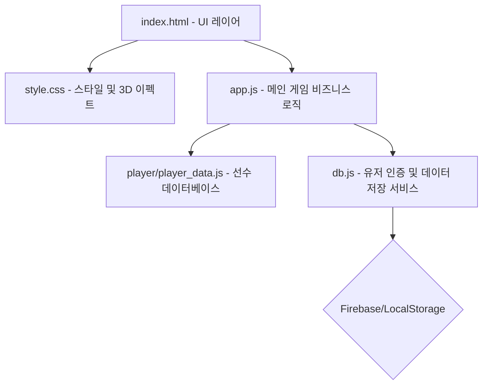

# ⚽ FC STAR 축구 카드 게임 개발 기록 (log.md)

이 파일은 **FC STAR 축구 카드 게임**의 개발 및 수정 이력을 실시간으로 상세히 기록하는 로그 파일입니다. 추가적인 작업이 진행될 때마다 지속적으로 업데이트됩니다.

---

## 📌 1. 프로젝트 개요
**FC STAR 축구 카드 게임**은 영어 단어 퀴즈를 풀고 획득한 포인트(FP)로 축구 선수 카드 팩을 오픈하여 자신만의 구단을 성장시키는 웹 기반의 교육용 카드 수집 게임입니다.
- **주요 기술**: HTML5, Vanilla CSS, Vanilla JavaScript, Firebase Firestore (로컬 모의 클라우드 지원)
- **핵심 요소**: 3D 카드 효과, 영어 단어 퀴즈 채점 시스템, 카드 수집 및 각성(Awakening) 시스템

---

## 🏗️ 2. 프로그램 전체 구조

- **`index.html`**: 카드 팩 뽑기 모달, 구단 관리 화면, 단어 퀴즈 화면, 로그인/회원가입 인터페이스 제공.
- **`style.css`**: 현대적인 Glassmorphism 카드 디자인 및 카드 뒤집기(Flipping), 3D 기울임(Tilt) 애니메이션 이펙트 처리.
- **`app.js`**: 단어 퀴즈 출제 및 채점 로직, 카드 뽑기 확률 제어, 덱 관리, 각성 업데이트 등 핵심 로직 제어.
- **`db.js`**: Firebase Firestore 기반 원격 저장 및 미지원 시 LocalStorage 기반의 가상 로컬 클라우드 전환 처리.
- **`player/player_data.js`**: 전체 축구선수 카드 스펙(오버롤, 세부 능력치, 포지션 등)을 동적으로 로드.

---

## 📅 3. 주요 작업 및 업데이트 이력

### 🔄 1) 영어 단어 퀴즈 시스템 반전 및 스마트 채점 적용
*   **기존 방식**: 한국어 뜻이 제시되면 영어 단어를 타이핑하는 방식.
*   **변경 사항 (반전)**: **영어 단어가 화면에 제시되면 한국어 뜻을 입력**하는 방식으로 전면 수정.
*   **동사/형용사 유연한 채점 로직 개발**:
    *   사용자가 완벽히 똑같은 정답을 적지 않더라도 핵심 키워드가 포함되면 정답으로 판정하는 유연한 알고리즘 탑재.
    *   예: 정답이 `~에 가다`일 때, 사용자가 `가다`만 입력해도 정답 판정.
    *   입력값 및 정답 텍스트에서 불필요한 조사, 특수 기호, 괄호 내용 등을 정규화(Normalization)하여 유사도 분석 후 정답률을 극대화함.

### 🃏 2) 카드 중복 획득 시 '각성(Awakening)' 시스템 구현
*   **기존 방식**: 카드를 뽑으면 수량(Quantity)이 단순 증가.
*   **변경 사항 (각성 시스템)**:
    *   모든 카드 수량은 **무조건 1개**로 고정.
    *   이미 보유하고 있는 동일한 카드를 중복 획득하는 경우, 기존 카드가 **'각성'** 상태로 전환됨.
    *   최대 **5각성(★5)**까지 성장 가능.
    *   각성이 1단계 상승할 때마다 **선수의 모든 오버롤 및 세부 능력치가 +1씩 증가**하는 스탯 부스트 효과 제공.
    *   UI 상에서 각성 수치를 별(★) 또는 텍스트로 화려하게 표현하도록 카드 렌더링 수정.

### 🎨 3) 카드 팩 오프닝 애니메이션 & 타이밍 연출 디버깅
*   **카드 팩 열기 오프닝 타이밍 정상화**:
    *   모달이 켜지기 전에 카드가 화면에 먼저 뒤집힌 상태로 렌더링되어 보이는 문제를 해결하기 위해 브라우저 강제 레이아웃 리플로우(`void wrapper.offsetWidth`)를 적용.
    *   모달 활성화 지연 시간을 조정(0.4초 ➔ 0.6초)하여 모달 배경이 완벽히 켜진 후 카드가 서서히 부드럽게 떠오르도록 애니메이션 연출을 조정.
*   **뒤집힌 상태(Back Face) 시작 연출 보정**:
    *   카드가 등장할 때 앞면(Front Face)이 일순간 노출되었다가 다시 뒤집히던 시각적 오류를 디버깅.
    *   카드를 초기화할 때 CSS `transition`을 일시적으로 꺼서(Snap) 강제로 카드 뒷면(FC STAR 로고) 상태로 배치한 후 애니메이션이 시작되도록 로직을 개선하여 연출 완성도를 극대화함.
*   **내 구단 영입하기 버튼(btnCollect) 충돌 수정**:
    *   가챠 오프닝 후 정상적으로 수집을 완료할 수 있도록 `index.html`에 누락되어 있던 `btnCollect` 버튼을 알맞은 위치에 재배치하고 동작을 연동함.

### 📝 4) 단어 퀴즈 최근 60개 단어 대상 순환 출제, 회차별 순차 출제 및 일 단위 초기화 적용
*   **기존 방식**: 전체 단어장(`QUIZ_WORDS`)에서 무작위로 10개를 섞어 출제하여 퀴즈 턴이 끝나도 매번 동일하거나 중복되는 문제가 발생할 여지가 있음.
*   **변경 사항**:
    *   **최근 60개 단어 제한 & 반복**: 단어 학습 효율 극대화를 위해 전체 단어장이 아닌 **최신 등록 순 60개 단어의 풀(Pool)**을 타겟팅하여 그 내부에서 반복 출제되도록 설계.
    *   **1회차(첫 번째 퀴즈 턴)**: 단어 등록 흐름상 가장 마지막에 배치되는 **최신 입력 단어 10개**를 역순(최신순)으로 추출하여 출제.
    *   **2회차 이후(연속 퀴즈 진행 시)**: 중복 출제를 원천 차단하기 위해 **공부 진도(Offset)**를 기억하는 시스템(`quizOffset`)을 탑재. 2회차에는 11~20번째 최신 단어, 3회차에는 21~30번째 최신 단어가 출제되도록 최적화.
    *   **일 단위 초기화 기능 탑재**: 매일 처음으로 퀴즈 탭에 진입할 때 공부 진도(`quizOffset`)가 **자동으로 0(최신 단어 우선)으로 초기화**되도록 날짜 체크 로직 설계. 하루 동안은 연속 학습 상태를 그대로 이어갈 수 있도록 Firebase와 LocalStorage에 진도와 날짜를 보존.
    *   **순환(Wrap-around) 설계**: 60개의 단어 풀 범위를 초과하는 경우 자동으로 0으로 리셋되어 다시 최신 단어부터 순환 학습할 수 있도록 설계하여 사용자 경험 극대화.
    *   새로 추가한 최신 단어부터 60번째 단어까지 차례대로 꼼꼼히 학습할 수 있습니다.

### 📚 5) 신규 교재 단어 추가 (18개 단어 업데이트)
*   **추가된 내용**: 사용자가 업로드한 4개의 단어장 이미지(교재 61-62 페이지 분량)를 분석하여 중복을 제외한 총 **18개의 신규 영단어와 뜻**을 `player/quiz_data.js`에 대거 추가하였습니다.
*   **등록된 신규 단어 리스트**:
    *   `need` (필요하다), `root` (뿌리), `sunlight` (햇빛), `take care of` (~을 돌보다), `take in` (~을 흡수하다), `thicker` (더 굵은), `through` (~의 곳곳으로), `trunk` ((나무)줄기), `try` (노력하다), `water` (물)
    *   `even` (훨씬), `food` (양분 (나무에 필요한 영양분)), `get` ((어떤 상태가) 되다), `grow` (자라다), `hard` (어려운), `help` (도움이 되다), `leaf [leaves]` (잎), `longer` (더 긴), `move` (이동시키다)
*   **퀴즈 시스템 연동**: 신규 단어들은 등록 방식 특성상 `QUIZ_WORDS` 배열 맨 마지막(최신)에 추가되었으므로, **"최근 60개 단어 대상 퀴즈 출제 정책"**에 의해 퀴즈 시작 시 1순위로 즉시 노출 및 학습할 수 있습니다.

### 🎨 6) 전북 현대 공식 엠블럼 (SVG) 적용 및 브랜드 디자인 강화
*   **배경**: 기존 트로피 및 쉴드 형태의 일반 FontAwesome 아이콘으로 렌더링되던 메인 팀 디자인 요소를 개선하여 팬심과 현실감을 높임.
*   **반영 사항**:
    *   **헤더 메인 로고**: 기존 트로피 아이콘 대신 `img/mark_jb.svg` 공식 엠블럼을 헤더 로고 영역에 완벽히 배치. 마크에 은은한 전북 초록색의 네온 글로우 효과(`filter: drop-shadow`)와 크기가 부드럽게 커졌다 작아지는 미세 애니메이션(`emblemPulse`)을 적용하여 고급스러운 아이덴티티 연출.
    *   **경기 진행 매치업 보드 (Scoreboard)**: 전북 현대가 홈 또는 원정팀으로 출제될 때 매치업 화면의 팀 엠블럼 영역에 공식 초록색 SVG 엠블럼을 동적으로 렌더링하도록 퀴즈/시뮬레이터 로직 개선.

### 📅 7) K리그 일 단위 진행 제한 및 경기 완료 포인트 보상 추가 & K리그 팀명 변경
*   **K리그 일 단위 경기 제한**: 학습 과적합 방지 및 현실적인 일 단위 리그 운영을 위해 **하루에 단 한 경기만 진행할 수 있도록 제한**을 구축했습니다.
    *   **개발자 모드 바이패스**: `ooks12` 계정의 개발자 모드 활성화 시에는 이 제한을 해제하여 무제한 시뮬레이션이 가능합니다.
*   **경기 참여 보상 시스템**: 경기 승패나 결과(승/무/패)와 전혀 무관하게, 리그 경기를 정상 완수하면 **무조건 +1 FP(가차 포인트) 보상**이 지급되도록 채점 보상을 확대 연동했습니다.
*   **K리그 참가 구단 교체**:
    *   `수원 FC` (suwon_fc) ➔ **`부천 FC` (bucheon_fc)** 로 교체.
    *   `대구 FC` (daegu) ➔ **`FC 안양` (anyang)** 로 교체.
    *   K리그 12팀 프리셋 및 라운드별 경기 대진 Fixtures까지 완벽히 교체 동기화 완료.

### 🧹 8) app.js 비대화 문제 해결을 위한 자바스크립트 구조 리팩토링 (전통적 스크립트 분할)
*   **리팩토링 배경**: `app.js` 파일이 2,500줄 이상으로 비대해져 코드 가독성 저하 및 검색 시간 지연 문제 발생.
*   **로컬 실행 보장(CORS 우회)**: 별도의 Node.js 서버나 가상 환경 없이 기존처럼 더블 클릭(`file://` 프로토콜)만으로도 즉시 실행이 가능하도록, HTML 스크립트 태그를 순서대로 나열하여 전역 스코프를 공유하는 **전통적 스크립트 분할 방식** 채택.
*   **모듈별 코드 이관**:
    *   **사운드 엔진 (`sound.js`)**: 오디오 연출 및 효과음 재생 로직(`initAudio()`, `playSound()`)을 완벽 분리.
    *   **영어 단어 퀴즈 엔진 (`quiz.js`)**: 단어 검증 로직(`checkKoreanAnswer()`), 퀴즈 상태 제어(`initQuizRound()`, `renderQuizCurrent()`), 정답 판정 및 패스 처리 등 약 500줄 가량의 독립된 비즈니스 로직 전량 이관.
*   **결과**: `app.js` 본문 파일 크기가 기존 약 2,500줄에서 **1,900줄 대**로 슬림해졌으며 코드 검색 및 수정 효율이 극대화됨.

### 🔄 9) 영어 단어 퀴즈 출제 순서 초기화 버튼 추가
*   **추가 배경**: 유저가 원할 때 최신으로 추가된 단어(맨 마지막 배열)부터 퀴즈가 다시 출제되도록 리셋하는 편의 기능 요청.
*   **반영 사항**:
    *   **UI 버튼 배치**: '영어 단어 퀴즈' 타이틀 옆에 미려하게 디자인된 **[🔄 순서 초기화]** 글래스모피즘 버튼 배치. 마우스 호버 시 금빛 광채 효과와 입체 애니메이션 구현.
    *   **초기화 비즈니스 로직 (`resetQuizOffset()`)**: 버튼 클릭 시 브라우저 컨펌 확인창을 띄운 뒤 `quizOffset`을 즉시 `0`으로 세팅하고 `initQuizRound()`를 호출하여 가장 최근 추가된 최신 단어 세트(역순 10개)부터 바로 출제되도록 갱신. 로컬스토리지 및 Firestore(로그인 상태 시)와도 즉시 연계 세이브되도록 안전 장치 적용.

### 🔄 10) 카드 뽑기 화면 보유 포인트 추가 표시
*   **추가 배경**: 유저가 카드 뽑기를 진행할 때 현재 보유한 FP(포인트)를 상단 헤더뿐만 아니라 카드 뽑기 버튼 바로 하단에서도 직관적으로 확인할 수 있도록 요청.
*   **반영 사항**:
    *   **UI 레이아웃**: `index.html` 내 카드 팩 개봉비용 바로 위에 보유 포인트를 보여주는 `.pack-points-info` 요소를 추가 디자인하여 배치.
    *   **동적 바인딩**: `app.js` 내 `renderUserPoints()`가 호출될 때 헤더 포인트 위젯뿐만 아니라 카드 뽑기 화면 내 신규 포인트 라벨(`#packUserPointsVal`)의 값도 실시간으로 동기화되어 갱신되도록 연동.

### 🎨 11) 모바일(360x800) 카드팩 빈공간 축소 및 중복 타이틀 숨김 처리
*   **추가 배경**:
    *   모바일 화면에서 카드팩 이미지가 0.75~0.85 비율로 축소되면서 발생하는 레이아웃 상의 과도한 하단 여백(Whitespace)을 줄여달라는 요청.
    *   하단 네비게이션 탭이 이미 각 메뉴를 직관적으로 명시하므로, 화면 상단의 크고 중복된 메인 섹션 타이틀 텍스트를 숨겨 화면을 효율적으로 활용하고자 함.
*   **반영 사항**:
    *   **카드팩 빈공간 해결**: `transform: scale()` 동작 시 차지하는 가상 영역과 실제 여백 편차를 계산하여 모바일 미디어 쿼리 내에 음수 `margin-bottom`(`-72px`, `-120px`)을 유동적으로 적용. 추가적으로 모바일 기기에서의 `.pack-container` `min-height: auto;`로 강제 조율하여 버튼이 카드팩 아래에 부드럽게 붙도록 개선.
    *   **중복 타이틀 숨김**: 모바일 브레이크포인트(max-width: 768px) 영역에서 모든 메인 섹션의 `h2.deck-title`을 `display: none;` 처리하여 단어 퀴즈 탭 내의 '순서 초기화' 및 '진행도' 위젯이 가로 일렬로 깔끔하게 배치되도록 공간 확보 극대화.

### 🎨 11) 모바일(360x800) 카드팩 빈공간 축소 및 중복 타이틀 숨김 처리
*   **추가 배경**:
    *   모바일 화면에서 카드팩 이미지가 0.75~0.85 비율로 축소되면서 발생하는 레이아웃 상의 과도한 하단 여백(Whitespace)을 줄여달라는 요청.
    *   하단 네비게이션 탭이 이미 각 메뉴를 직관적으로 명시하므로, 화면 상단의 크고 중복된 메인 섹션 타이틀 텍스트를 숨겨 화면을 효율적으로 활용하고자 함.
*   **반영 사항**:
    *   **카드팩 빈공간 해결**: `transform: scale()` 동작 시 차지하는 가상 영역과 실제 여백 편차를 계산하여 모바일 미디어 쿼리 내에 음수 `margin-bottom`(`-72px`, `-120px`)을 유동적으로 적용. 추가적으로 모바일 기기에서의 `.pack-container` `min-height: auto;`로 강제 조율하여 버튼이 카드팩 아래에 부드럽게 붙도록 개선.
    *   **중복 타이틀 숨김**: 모바일 브레이크포인트(max-width: 768px) 영역에서 모든 메인 섹션의 `h2.deck-title`을 `display: none;` 처리하여 단어 퀴즈 탭 내의 '순서 초기화' 및 '진행도' 위젯이 가로 일렬로 깔끔하게 배치되도록 공간 확보 극대화.

### 🎓 12) 영어 단어 퀴즈 레벨(Level) 시스템 도입
*   **추가 배경**: 유저가 단어 학습을 연속으로 완수할 때 학습 동기 부여 및 성취감을 고취시킬 수 있도록 RPG 스타일의 레벨(Level) 성장 시스템 탑재 요청.
*   **반영 사항**:
    *   **레벨 성장 로직**: 단어 퀴즈 1세트(10문제 완료)를 모두 올바르게 해결할 때마다 **사용자의 레벨이 1씩 영구 증가**하도록 비즈니스 엔진(`quiz.js`) 개편.
    *   **영구 저장 및 클라우드 동기화**: `userLevel` 변수를 전역 선언하여 로컬스토리지(`fc_star_user_level`) 캐싱 및 로그인 상태 시 `db.js` Firestore 가상/실제 클라우드 서버 데이터 백업 시스템과 자동 세이브 연동 완료.
    *   **단어 퀴즈 화면 UI**: '영어 단어 퀴즈' 탭 내 우측 진행도 바로 옆에 **레벨: 1** 형태로 레벨 표시기 추가 바인딩.
    *   **레벨업 축하 피드백 연출**: 10문제 완료 시 나타나는 성공 오버레이에 **"레벨 업! Lv. X 달성 🚀"** 골드 뱃지를 동적으로 구현하여 시각적 성취감 극대화.

### 🎁 13) 레벨별 특별 보상 및 '이승우' 특급 선수카드 지급 시스템 구축
*   **추가 배경**: 특정 타겟 레벨 달성 시 유저에게 장기적인 학습 목표를 제시하고, 도달 시 즉각적이고 특별한 보상을 안겨주는 성장 보상 시스템 구축 요청.
*   **반영 사항**:
    *   **레벨 2 도달 시 목표 알림**: 영어 단어 퀴즈 세트 완료 후 레벨 2가 되는 시점에 **"레벨 10 달성 시 '이승우' 카드를 획득할 수 있습니다. 레벨 10마다 '특별한' 카드가 제공됩니다."** 라는 골드 테두리형 전용 프리미엄 안내 팝업(`levelRewardModal`)을 노출해 동기 부여 제공.
    *   **레벨 10 도달 시 이승우 카드 확정 지급**: 실제로 퀴즈를 풀어 레벨 10을 달성하는 순간, **"이승우(LW, 오버롤 82)"** 선수 카드를 사용자 덱(`playerDeck`)에 강제 지급 및 저장 처리. 이미 보유하고 있다면 **각성 수치(Awakening)를 +1** 상승시켜 수집 가치를 보존.
    *   **레벨 20, 30 등 10배수 고레벨 도달 시 랜덤 카드 보상 지급**: 향후 추가될 레벨별 고유 스페셜 카드가 준비되기 전 임시 조치로, **레벨 20, 30, 40 등 10의 배수(단, 10레벨 제외)에 도달할 때마다 선수 데이터베이스(CARDS_DATABASE)에서 무작위로 1명을 추출하여 즉시 지급하는 룰 적용**. 동일 카드를 보유 중일 시 각성 수치(+1) 상승 연계 적용 완료.
    *   **레벨 보상 팝업 레이아웃**: 프리미엄 글래스모피즘 기반의 전용 알림 창 `#levelRewardModal`을 `index.html`에 구조 설계하여 확인 버튼 클릭 시 자연스러운 애니메이션과 함께 닫히도록 제작. 앞으로도 레벨 10이 오를 때마다 특별 보상이 지급될 것임을 나타내는 안내 문구도 추가 바인딩 완료.
    *   **개발자 레벨 조율 디버거 추가**: `ooks12` 계정의 개발자 모드 전용으로 단어 퀴즈 화면 내 **레벨 라벨을 클릭 시 임의의 레벨로 강제 조정할 수 있는 `developerSetLevel()` 치트 탑재**. 이를 통해 레벨 10 또는 20, 30으로 즉시 조율 시 퀴즈 실전 완료 타이밍과 정확히 100% 동일하게 이승우/랜덤카드 획득 팝업 및 수집 저장이 완벽하게 작동하는지 개발자 단독으로 빠르게 교차 검증 가능하도록 연동 완료.

### 🃏 14) 내 컬렉션(덱) 카드 능력치(Rating) 내림차순 정렬 적용
*   **추가 배경**: 유저가 수집한 카드들이 영입 순서가 아닌, 선수의 실제 능력치(오버롤 점수)가 높은 순대로 정렬되어야 구단의 전력 분포를 한눈에 직관적으로 파악할 수 있으므로 이에 대한 정렬 시스템 개선 요청.
*   **반영 사항**:
    *   **정렬 정밀화**: `app.js` 내 `renderDeck()` 렌더링 함수에 내장 정렬(`keys.sort()`) 알고리즘 설계.
    *   **각성 보너스 연계 적용**: 선수의 단순 '기본 능력치'뿐만 아니라 중복 카드를 획득하여 상승한 **'각성 보너스 스탯(+1~+5)'이 최종 합산 반영된 실제 오버롤 점수(`getAwakenedCard().rating`)를 기준**으로 실시간 내림차순(점수가 높은 순)으로 자동 정렬되도록 고도화하여 수집 성장의 재미를 강화.

### 🃏 15) 레벨 20 특별 보상 '손흥민' 카드 출시 및 연동
*   **추가 배경**: 유저가 10레벨을 돌파하고 장기적인 성장의 가치를 느낄 수 있도록 레벨 20 도달 시 대한민국을 대표하는 프리미어리그 월드스타 '손흥민' 특별 카드가 100% 확정 지급되도록 특별 보상 라인업 확장 요청.
*   **반영 사항**:
    *   **손흥민 선수 데이터 생성 (`player/player_data.js`)**: 토트넘 홋스퍼 브랜드 테마(딥 네이비 `#132257`, 화이트, 골드 광채)를 적용하고, 월드클래스 오버롤 점수 **`89`**에 포지션 **`LW`**, 초고속 페이스(`PAC: 91`), 가공할 결정력(`SHO: 89`) 스펙의 특급 선수 카드 객체 `"son_heung_min"` 제작 완료.
    *   **레벨 20 획득 로직 탑재 (`app.js`)**: 퀴즈 1세트 완료로 **레벨 20**에 도달하는 시점에 손흥민 카드가 확정 영입되며, 덱 소유 시 각성 단계(+1)가 증가하도록 연동. 전용 축하 팝업과 전용 문구(*Lv. 20 도달 기념으로 대한민국 최고의 월드클래스 슈퍼스타 '손흥민' 선수카드가 지급되었습니다!*)가 나오도록 모달 출력 분리 설계 완료.

---

## 📁 4. 수정된 파일 리스트 및 역할

| 파일명 | 변경된 내용 요약 |
| :--- | :--- |
| **[index.html](file:///c:/Users/ooks1/OneDrive/바탕 화면/축구카드/index.html)** | 카드팩 보유 포인트 표기 추가, 단어 퀴즈 진행도 옆 레벨 표시, 레벨업 특별 보상 및 목표 알림 팝업창(#levelRewardModal) 구조 추가 |
| **[app.js](file:///c:/Users/ooks1/OneDrive/바탕 화면/축구카드/app.js)** | 레벨 보상 로직 분리 및 **레벨 20 도달 시 손흥민 확정 지급/팝업 노출 추가**, 내 컬렉션 각성 반영 점수별 내림차순 정렬 적용 |
| **[db.js](file:///c:/Users/ooks1/OneDrive/바탕 화면/축구카드/db.js)** | 회원가입 초기 defaultData 구조에 초기 userLevel: 1 필드 추가 동기화 |
| **[quiz.js](file:///c:/Users/ooks1/OneDrive/바탕 화면/축구카드/quiz.js)** | 10문제 성공 시 userLevel 레벨값 1 증가 및 로컬스토리지 저장, 레벨업 성공 모달 배너 정보 바인딩 연계 |
| **[style.css](file:///c:/Users/ooks1/OneDrive/바탕 화면/축구카드/style.css)** | 선수 이미지 z-index 조정(3->1)으로 최하단 배치 완료, 모바일 카드팩 축소 여백 마진 적용 및 중복 타이틀 숨김 |
| **[player/player_data.js](file:///c:/Users/ooks1/OneDrive/바탕 화면/축구카드/player/player_data.js)** | **월드클래스 특급 공격수 '손흥민(son_heung_min, 오버롤 89)' 선수 정보 추가 제작** |
| **[player/quiz_data.js](file:///c:/Users/ooks1/OneDrive/바탕 화면/축구카드/player/quiz_data.js)** | 교재 이미지에서 추출된 18개의 신규 영어 단어장 데이터 추가 |
| **[FCstar_todo.txt](file:///c:/Users/ooks1/OneDrive/바탕 화면/축구카드/FCstar_todo.txt)** | 향후 추가될 예정인 기능들에 대한 일정 및 요구사항 목록 관리 |

---

## 🔮 5. 향후 작업 계획 (Next Actions)
- [x] **개발자 모드 추가**: 클릭 한 번으로 경기 시뮬레이션 즉시 완료, FP 포인트 치트 기능.
- [x] **리그 시스템 보완**: 시즌 종료 후 전체 리셋 방식에서 '다음 연도 시즌 돌입' 방식으로 마이그레이션.
- [x] **명예의 전당 기능**: 각 시즌별 순위와 기록을 보존하는 신규 페이지 개발.
- [x] **코드 최적화 및 모듈화**: 비대해진 `app.js`를 로컬 실행에 지장 없도록 분할 리팩토링 완료.
- [ ] **스페셜 선수 카드**: 감독 레벨 혹은 특정 미션 완료 시 증정하는 한정판 스페셜 선수 시스템 도입.

