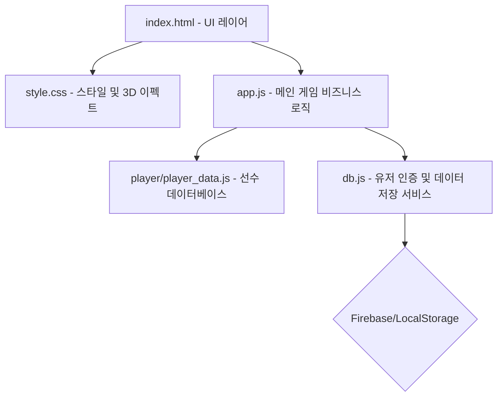

# ⚽ FC STAR 축구 카드 게임 개발 기록 (log.md)

이 파일은 **FC STAR 축구 카드 게임**의 개발 및 수정 이력을 실시간으로 상세히 기록하는 로그 파일입니다. 추가적인 작업이 진행될 때마다 지속적으로 업데이트됩니다.

---

## 📌 1. 프로젝트 개요
**FC STAR 축구 카드 게임**은 영어 단어 퀴즈를 풀고 획득한 포인트(FP)로 축구 선수 카드 팩을 오픈하여 자신만의 구단을 성장시키는 웹 기반의 교육용 카드 수집 게임입니다.
- **주요 기술**: HTML5, Vanilla CSS, Vanilla JavaScript, Firebase Firestore (로컬 모의 클라우드 지원)
- **핵심 요소**: 3D 카드 효과, 영어 단어 퀴즈 채점 시스템, 카드 수집 및 각성(Awakening) 시스템

---

## 🏗️ 2. 프로그램 전체 구조

- **`index.html`**: 카드 팩 뽑기 모달, 구단 관리 화면, 단어 퀴즈 화면, 로그인/회원가입 인터페이스 제공.
- **`style.css`**: 현대적인 Glassmorphism 카드 디자인 및 카드 뒤집기(Flipping), 3D 기울임(Tilt) 애니메이션 이펙트 처리.
- **`app.js`**: 단어 퀴즈 출제 및 채점 로직, 카드 뽑기 확률 제어, 덱 관리, 각성 업데이트 등 핵심 로직 제어.
- **`db.js`**: Firebase Firestore 기반 원격 저장 및 미지원 시 LocalStorage 기반의 가상 로컬 클라우드 전환 처리.
- **`player/player_data.js`**: 전체 축구선수 카드 스펙(오버롤, 세부 능력치, 포지션 등)을 동적으로 로드.

---

## 📅 3. 주요 작업 및 업데이트 이력

### 🔄 1) 영어 단어 퀴즈 시스템 반전 및 스마트 채점 적용
*   **기존 방식**: 한국어 뜻이 제시되면 영어 단어를 타이핑하는 방식.
*   **변경 사항 (반전)**: **영어 단어가 화면에 제시되면 한국어 뜻을 입력**하는 방식으로 전면 수정.
*   **동사/형용사 유연한 채점 로직 개발**:
    *   사용자가 완벽히 똑같은 정답을 적지 않더라도 핵심 키워드가 포함되면 정답으로 판정하는 유연한 알고리즘 탑재.
    *   예: 정답이 `~에 가다`일 때, 사용자가 `가다`만 입력해도 정답 판정.
    *   입력값 및 정답 텍스트에서 불필요한 조사, 특수 기호, 괄호 내용 등을 정규화(Normalization)하여 유사도 분석 후 정답률을 극대화함.

### 🃏 2) 카드 중복 획득 시 '각성(Awakening)' 시스템 구현
*   **기존 방식**: 카드를 뽑으면 수량(Quantity)이 단순 증가.
*   **변경 사항 (각성 시스템)**:
    *   모든 카드 수량은 **무조건 1개**로 고정.
    *   이미 보유하고 있는 동일한 카드를 중복 획득하는 경우, 기존 카드가 **'각성'** 상태로 전환됨.
    *   최대 **5각성(★5)**까지 성장 가능.
    *   각성이 1단계 상승할 때마다 **선수의 모든 오버롤 및 세부 능력치가 +1씩 증가**하는 스탯 부스트 효과 제공.
    *   UI 상에서 각성 수치를 별(★) 또는 텍스트로 화려하게 표현하도록 카드 렌더링 수정.

### 🎨 3) 카드 팩 오프닝 애니메이션 & 타이밍 연출 디버깅
*   **카드 팩 열기 오프닝 타이밍 정상화**:
    *   모달이 켜지기 전에 카드가 화면에 먼저 뒤집힌 상태로 렌더링되어 보이는 문제를 해결하기 위해 브라우저 강제 레이아웃 리플로우(`void wrapper.offsetWidth`)를 적용.
    *   모달 활성화 지연 시간을 조정(0.4초 ➔ 0.6초)하여 모달 배경이 완벽히 켜진 후 카드가 서서히 부드럽게 떠오르도록 애니메이션 연출을 조정.
*   **뒤집힌 상태(Back Face) 시작 연출 보정**:
    *   카드가 등장할 때 앞면(Front Face)이 일순간 노출되었다가 다시 뒤집히던 시각적 오류를 디버깅.
    *   카드를 초기화할 때 CSS `transition`을 일시적으로 꺼서(Snap) 강제로 카드 뒷면(FC STAR 로고) 상태로 배치한 후 애니메이션이 시작되도록 로직을 개선하여 연출 완성도를 극대화함.
*   **내 구단 영입하기 버튼(btnCollect) 충돌 수정**:
    *   가챠 오프닝 후 정상적으로 수집을 완료할 수 있도록 `index.html`에 누락되어 있던 `btnCollect` 버튼을 알맞은 위치에 재배치하고 동작을 연동함.

### 📝 4) 날짜별 인텔리전트 영단어 스케줄러 출제 엔진 도입 및 셔플 출제 설계
*   **기존 방식**: 최근 추가된 순 60개 단어 중에서 순차적으로 오프셋(`quizOffset`)을 추적하고 순차 범위 학습을 제어하던 방식.
*   **변경 사항 (지능형 스케줄러)**:
    *   **날짜 기반 자동 매핑**: 시스템 날짜를 감지하여 `QUIZ_WORDS_BY_DATE` 맵핑 객체에서 **"오늘보다 작거나 같으면서(<=) 가장 최신인 날짜"**에 등록된 교재 단어 세트(각 22단어 분량)를 실시간 판단하여 출제 풀로 자동 연계.
    *   **Fisher-Yates 무작위 셔플**: 해당 날짜 세트의 전체 단어 풀을 무작위로 섞은 후 **정확히 5개의 단어**만을 퀴즈 큐(`quizQueue`)로 추출하여 중복 없이 다이내믹하게 출제.
    *   **오프라인 가드 및 안전 보장(Fallback) 구축**: 매칭되는 날짜 스케줄이 비어 있거나 부재할 경우 자동으로 전역 통합 백업 풀(`QUIZ_WORDS`)의 최신 25개 단어로 즉시 리턴(Fallback)하여 시스템 먹통 및 예외 충돌을 완벽 차단.

### 📚 5) 신규 대규모 교재 단어 업데이트 (총 8개 예약 그룹, 402개 단어 대규모 확장)
*   **추가된 내용**: 교재의 주요 챕터 및 이미지(1번부터 14번) 전체를 분석하여 중복이 제거된 **총 176개의 신규 영단어와 뜻**을 이원화 탑재(일자별 스케줄러 세트 + 전역 백업 풀).
*   **등록된 신규 스케줄러 날짜 및 주제 그룹 (각 22단어 탑재, 총 176단어)**:
    *   `260531`: 디바이스 사용 습관, 두뇌 자극 및 숙면 유도 (22단어)
    *   `260602`: 일상 기상, 캠핑, 날씨 및 감정 묘사 (22단어)
    *   `260606`: 용, 불, 경기 승리 및 준비 행동 동사 (22단어)
    *   `260609`: 자연환경, 연못, 껍데기 및 달팽이/곤충 보호 (22단어)
    *   `260613`: 지구본, 종/시계 알람 및 묘사 공간 도형 (22단어)
    *   `260616`: 종이접기, 삼각형/직사각형 및 방향/날개 묘사 (22단어)
    *   `260620`: 중간 크기, 신체(입, 코, 혀) 및 2차원 다각형 오려 내기 (22단어)
    *   `260623`: 요트, 우주선, 파인애플 및 입체 공간 모퉁이 묘사 (22단어)
*   **퀴즈 시스템 연동**: 전역 백업 풀(`QUIZ_WORDS`)이 기존 226단어에서 신규 단어 176단어가 하단에 차곡차곡 동기화 누적되어 **총 402단어**의 역대 최대 규모 영단어 보관소로 업그레이드 완료.

### 🎨 6) 전북 현대 공식 엠블럼 (SVG) 적용 및 브랜드 디자인 강화
*   **배경**: 기존 트로피 및 쉴드 형태의 일반 FontAwesome 아이콘으로 렌더링되던 메인 팀 디자인 요소를 개선하여 팬심과 현실감을 높임.
*   **반영 사항**:
    *   **헤더 메인 로고**: 기존 트로피 아이콘 대신 `img/mark_jb.svg` 공식 엠블럼을 헤더 로고 영역에 완벽히 배치. 마크에 은은한 전북 초록색의 네온 글로우 효과(`filter: drop-shadow`)와 크기가 부드럽게 커졌다 작아지는 미세 애니메이션(`emblemPulse`)을 적용하여 고급스러운 아이덴티티 연출.
    *   **경기 진행 매치업 보드 (Scoreboard)**: 전북 현대가 홈 또는 원정팀으로 출제될 때 매치업 화면의 팀 엠블럼 영역에 공식 초록색 SVG 엠블럼을 동적으로 렌더링하도록 퀴즈/시뮬레이터 로직 개선.

### 📅 7) K리그 일 단위 진행 제한 및 경기 완료 포인트 보상 추가 & K리그 팀명 변경
*   **K리그 일 단위 경기 제한**: 학습 과적합 방지 및 현실적인 일 단위 리그 운영을 위해 **하루에 단 한 경기만 진행할 수 있도록 제한**을 구축했습니다.
    *   **개발자 모드 바이패스**: `ooks12` 계정의 개발자 모드 활성화 시에는 이 제한을 해제하여 무제한 시뮬레이션이 가능합니다.
*   **경기 참여 보상 시스템**: 경기 승패나 결과(승/무/패)와 전혀 무관하게, 리그 경기를 정상 완수하면 **무조건 +1 FP(가차 포인트) 보상**이 지급되도록 채점 보상을 확대 연동했습니다.
*   **K리그 참가 구단 교체**:
    *   `수원 FC` (suwon_fc) ➔ **`부천 FC` (bucheon_fc)** 로 교체.
    *   `대구 FC` (daegu) ➔ **`FC 안양` (anyang)** 로 교체.
    *   K리그 12팀 프리셋 및 라운드별 경기 대진 Fixtures까지 완벽히 교체 동기화 완료.

### 🧹 8) app.js 비대화 문제 해결을 위한 자바스크립트 구조 리팩토링 (전통적 스크립트 분할)
*   **리팩토링 배경**: `app.js` 파일이 2,500줄 이상으로 비대해져 코드 가독성 저하 및 검색 시간 지연 문제 발생.
*   **로컬 실행 보장(CORS 우회)**: 별도의 Node.js 서버나 가상 환경 없이 기존처럼 더블 클릭(`file://` 프로토콜)만으로도 즉시 실행이 가능하도록, HTML 스크립트 태그를 순서대로 나열하여 전역 스코프를 공유하는 **전통적 스크립트 분할 방식** 채택.
*   **모듈별 코드 이관**:
    *   **사운드 엔진 (`sound.js`)**: 오디오 연출 및 효과음 재생 로직(`initAudio()`, `playSound()`)을 완벽 분리.
    *   **영어 단어 퀴즈 엔진 (`quiz.js`)**: 단어 검증 로직(`checkKoreanAnswer()`), 퀴즈 상태 제어(`initQuizRound()`, `renderQuizCurrent()`), 정답 판정 및 패스 처리 등 약 500줄 가량의 독립된 비즈니스 로직 전량 이관.
*   **결과**: `app.js` 본문 파일 크기가 기존 약 2,500줄에서 **1,900줄 대**로 슬림해졌으며 코드 검색 및 수정 효율이 극대화됨.

### 🔄 9) 영어 단어 퀴즈 출제 순서 초기화 버튼 추가
*   **추가 배경**: 유저가 원할 때 최신으로 추가된 단어(맨 마지막 배열)부터 퀴즈가 다시 출제되도록 리셋하는 편의 기능 요청.
*   **반영 사항**:
    *   **UI 버튼 배치**: '영어 단어 퀴즈' 타이틀 옆에 미려하게 디자인된 **[🔄 순서 초기화]** 글래스모피즘 버튼 배치. 마우스 호버 시 금빛 광채 효과와 입체 애니메이션 구현.
    *   **초기화 비즈니스 로직 (`resetQuizOffset()`)**: 버튼 클릭 시 브라우저 컨펌 확인창을 띄운 뒤 `quizOffset`을 즉시 `0`으로 세팅하고 `initQuizRound()`를 호출하여 가장 최근 추가된 최신 단어 세트(역순 10개)부터 바로 출제되도록 갱신. 로컬스토리지 및 Firestore(로그인 상태 시)와도 즉시 연계 세이브되도록 안전 장치 적용.

### 🔄 10) 카드 뽑기 화면 보유 포인트 추가 표시
*   **추가 배경**: 유저가 카드 뽑기를 진행할 때 현재 보유한 FP(포인트)를 상단 헤더뿐만 아니라 카드 뽑기 버튼 바로 하단에서도 직관적으로 확인할 수 있도록 요청.
*   **반영 사항**:
    *   **UI 레이아웃**: `index.html` 내 카드 팩 개봉비용 바로 위에 보유 포인트를 보여주는 `.pack-points-info` 요소를 추가 디자인하여 배치.
    *   **동적 바인딩**: `app.js` 내 `renderUserPoints()`가 호출될 때 헤더 포인트 위젯뿐만 아니라 카드 뽑기 화면 내 신규 포인트 라벨(`#packUserPointsVal`)의 값도 실시간으로 동기화되어 갱신되도록 연동.

### 🎨 11) 모바일(360x800) 카드팩 빈공간 축소 및 중복 타이틀 숨김 처리
*   **추가 배경**:
    *   모바일 화면에서 카드팩 이미지가 0.75~0.85 비율로 축소되면서 발생하는 레이아웃 상의 과도한 하단 여백(Whitespace)을 줄여달라는 요청.
    *   하단 네비게이션 탭이 이미 각 메뉴를 직관적으로 명시하므로, 화면 상단의 크고 중복된 메인 섹션 타이틀 텍스트를 숨겨 화면을 효율적으로 활용하고자 함.
*   **반영 사항**:
    *   **카드팩 빈공간 해결**: `transform: scale()` 동작 시 차지하는 가상 영역과 실제 여백 편차를 계산하여 모바일 미디어 쿼리 내에 음수 `margin-bottom`(`-72px`, `-120px`)을 유동적으로 적용. 추가적으로 모바일 기기에서의 `.pack-container` `min-height: auto;`로 강제 조율하여 버튼이 카드팩 아래에 부드럽게 붙도록 개선.
    *   **중복 타이틀 숨김**: 모바일 브레이크포인트(max-width: 768px) 영역에서 모든 메인 섹션의 `h2.deck-title`을 `display: none;` 처리하여 단어 퀴즈 탭 내의 '순서 초기화' 및 '진행도' 위젯이 가로 일렬로 깔끔하게 배치되도록 공간 확보 극대화.

### 🎨 11) 모바일(360x800) 카드팩 빈공간 축소 및 중복 타이틀 숨김 처리
*   **추가 배경**:
    *   모바일 화면에서 카드팩 이미지가 0.75~0.85 비율로 축소되면서 발생하는 레이아웃 상의 과도한 하단 여백(Whitespace)을 줄여달라는 요청.
    *   하단 네비게이션 탭이 이미 각 메뉴를 직관적으로 명시하므로, 화면 상단의 크고 중복된 메인 섹션 타이틀 텍스트를 숨겨 화면을 효율적으로 활용하고자 함.
*   **반영 사항**:
    *   **카드팩 빈공간 해결**: `transform: scale()` 동작 시 차지하는 가상 영역과 실제 여백 편차를 계산하여 모바일 미디어 쿼리 내에 음수 `margin-bottom`(`-72px`, `-120px`)을 유동적으로 적용. 추가적으로 모바일 기기에서의 `.pack-container` `min-height: auto;`로 강제 조율하여 버튼이 카드팩 아래에 부드럽게 붙도록 개선.
    *   **중복 타이틀 숨김**: 모바일 브레이크포인트(max-width: 768px) 영역에서 모든 메인 섹션의 `h2.deck-title`을 `display: none;` 처리하여 단어 퀴즈 탭 내의 '순서 초기화' 및 '진행도' 위젯이 가로 일렬로 깔끔하게 배치되도록 공간 확보 극대화.

### 🎓 12) 영어 단어 퀴즈 레벨(Level) 시스템 도입
*   **추가 배경**: 유저가 단어 학습을 연속으로 완수할 때 학습 동기 부여 및 성취감을 고취시킬 수 있도록 RPG 스타일의 레벨(Level) 성장 시스템 탑재 요청.
*   **반영 사항**:
    *   **레벨 성장 로직**: 단어 퀴즈 1세트(10문제 완료)를 모두 올바르게 해결할 때마다 **사용자의 레벨이 1씩 영구 증가**하도록 비즈니스 엔진(`quiz.js`) 개편.
    *   **영구 저장 및 클라우드 동기화**: `userLevel` 변수를 전역 선언하여 로컬스토리지(`fc_star_user_level`) 캐싱 및 로그인 상태 시 `db.js` Firestore 가상/실제 클라우드 서버 데이터 백업 시스템과 자동 세이브 연동 완료.
    *   **단어 퀴즈 화면 UI**: '영어 단어 퀴즈' 탭 내 우측 진행도 바로 옆에 **레벨: 1** 형태로 레벨 표시기 추가 바인딩.
    *   **레벨업 축하 피드백 연출**: 10문제 완료 시 나타나는 성공 오버레이에 **"레벨 업! Lv. X 달성 🚀"** 골드 뱃지를 동적으로 구현하여 시각적 성취감 극대화.

### 🎁 13) 레벨별 특별 보상 및 '이승우' 특급 선수카드 지급 시스템 구축
*   **추가 배경**: 특정 타겟 레벨 달성 시 유저에게 장기적인 학습 목표를 제시하고, 도달 시 즉각적이고 특별한 보상을 안겨주는 성장 보상 시스템 구축 요청.
*   **반영 사항**:
    *   **레벨 2 도달 시 목표 알림**: 영어 단어 퀴즈 세트 완료 후 레벨 2가 되는 시점에 **"레벨 10 달성 시 '이승우' 카드를 획득할 수 있습니다. 레벨 10마다 '특별한' 카드가 제공됩니다."** 라는 골드 테두리형 전용 프리미엄 안내 팝업(`levelRewardModal`)을 노출해 동기 부여 제공.
    *   **레벨 10 도달 시 이승우 카드 확정 지급**: 실제로 퀴즈를 풀어 레벨 10을 달성하는 순간, **"이승우(LW, 오버롤 82)"** 선수 카드를 사용자 덱(`playerDeck`)에 강제 지급 및 저장 처리. 이미 보유하고 있다면 **각성 수치(Awakening)를 +1** 상승시켜 수집 가치를 보존.
    *   **레벨 20, 30 등 10배수 고레벨 도달 시 랜덤 카드 보상 지급**: 향후 추가될 레벨별 고유 스페셜 카드가 준비되기 전 임시 조치로, **레벨 20, 30, 40 등 10의 배수(단, 10레벨 제외)에 도달할 때마다 선수 데이터베이스(CARDS_DATABASE)에서 무작위로 1명을 추출하여 즉시 지급하는 룰 적용**. 동일 카드를 보유 중일 시 각성 수치(+1) 상승 연계 적용 완료.
    *   **레벨 보상 팝업 레이아웃**: 프리미엄 글래스모피즘 기반의 전용 알림 창 `#levelRewardModal`을 `index.html`에 구조 설계하여 확인 버튼 클릭 시 자연스러운 애니메이션과 함께 닫히도록 제작. 앞으로도 레벨 10이 오를 때마다 특별 보상이 지급될 것임을 나타내는 안내 문구도 추가 바인딩 완료.
    *   **개발자 레벨 조율 디버거 추가**: `ooks12` 계정의 개발자 모드 전용으로 단어 퀴즈 화면 내 **레벨 라벨을 클릭 시 임의의 레벨로 강제 조정할 수 있는 `developerSetLevel()` 치트 탑재**. 이를 통해 레벨 10 또는 20, 30으로 즉시 조율 시 퀴즈 실전 완료 타이밍과 정확히 100% 동일하게 이승우/랜덤카드 획득 팝업 및 수집 저장이 완벽하게 작동하는지 개발자 단독으로 빠르게 교차 검증 가능하도록 연동 완료.

### 🃏 14) 내 컬렉션(덱) 카드 능력치(Rating) 내림차순 정렬 적용
*   **추가 배경**: 유저가 수집한 카드들이 영입 순서가 아닌, 선수의 실제 능력치(오버롤 점수)가 높은 순대로 정렬되어야 구단의 전력 분포를 한눈에 직관적으로 파악할 수 있으므로 이에 대한 정렬 시스템 개선 요청.
*   **반영 사항**:
    *   **정렬 정밀화**: `app.js` 내 `renderDeck()` 렌더링 함수에 내장 정렬(`keys.sort()`) 알고리즘 설계.
    *   **각성 보너스 연계 적용**: 선수의 단순 '기본 능력치'뿐만 아니라 중복 카드를 획득하여 상승한 **'각성 보너스 스탯(+1~+5)'이 최종 합산 반영된 실제 오버롤 점수(`getAwakenedCard().rating`)를 기준**으로 실시간 내림차순(점수가 높은 순)으로 자동 정렬되도록 고도화하여 수집 성장의 재미를 강화.

### 🃏 15) 레벨 20 특별 보상 '손흥민' 카드 출시 및 연동
*   **추가 배경**: 유저가 10레벨을 돌파하고 장기적인 성장의 가치를 느낄 수 있도록 레벨 20 도달 시 대한민국을 대표하는 프리미어리그 월드스타 '손흥민' 특별 카드가 100% 확정 지급되도록 특별 보상 라인업 확장 요청.
*   **반영 사항**:
    *   **손흥민 선수 데이터 생성 (`player/player_data.js`)**: 토트넘 홋스퍼 브랜드 테마(딥 네이비 `#132257`, 화이트, 골드 광채)를 적용하고, 월드클래스 오버롤 점수 **`89`**에 포지션 **`LW`**, 초고속 페이스(`PAC: 91`), 가공할 결정력(`SHO: 89`) 스펙의 특급 선수 카드 객체 `"son_heung_min"` 제작 완료.
    *   **레벨 20 획득 로직 탑재 (`app.js`)**: 퀴즈 1세트 완료로 **레벨 20**에 도달하는 시점에 손흥민 카드가 확정 영입되며, 덱 소유 시 각성 단계(+1)가 증가하도록 연동. 전용 축하 팝업과 전용 문구(*Lv. 20 도달 기념으로 대한민국 최고의 월드클래스 슈퍼스타 '손흥민' 선수카드가 지급되었습니다!*)가 나오도록 모달 출력 분리 설계 완료.

### 🃏 16) 레벨 30 특별 보상 '이강인' 전설 카드 출시 및 연동
*   **추가 배경**: 레벨 20에 이어 레벨 30 도달 시 수집할 수 있는 대한민국 대표 특급 플레이어 '이강인' 특별 전설 카드의 추가 및 전용 지급 연동 요청.
*   **반영 사항**:
    *   **이강인 선수 데이터 생성 (`player/player_data.js`)**: 파리 생제르맹(PSG) 팀 테마(파리 블루 `#002F6C`, 레드, 골드 프레임)를 입히고, 전설 카드 등급으로 오버롤 **`86`**, 포지션 **`CAM`**, 탁월한 패싱(`PAS: 89`) 및 드리블(`DRI: 88`) 능력치를 가진 특급 미드필더 `"lee_kang_in"` 카드 추가 완료.
    *   **레벨 30 달성 보상 연동 (`app.js`)**: 사용자가 퀴즈를 완료하여 **레벨 30**에 도달하는 순간 이강인 전설 카드를 사용자 덱에 강제 지급 및 저장되도록 구현. 중복 소유 시 각성 수치(+1)가 적용되며, 레벨 30 달성 전용 보상 축하 문구가 동적으로 팝업되도록 설정 완료.

### 🛡️ 17) 전북 현대 18인 전체 선수 카드 특징 설명 작성 및 '캡틴' 김태환 특별 표기
*   **추가 배경**: 구단에 소속된 모든 선수 카드의 몰입도와 재미를 높이기 위해, 각 선수의 개성을 반영한 고유의 백-설명(Characteristics/Description)을 부여하고, 전북 현대의 주장인 김태환 선수에게 캡틴 관련 표기를 추가하도록 요청.
*   **반영 사항**:
    *   **18인 선수 고유 설명 부여 (`player/player_data.js`)**: `lee_bum_soo`, `kim_tae_hwan`, `jeong_tae_wook`, `구자룡`, `안현범` 등 전북 현대 스쿼드 18명 전원의 포지션 및 플레이 스타일을 반영한 다채롭고 고급스러운 설명 텍스트를 `description` 필드로 대거 작성 및 추가.
    *   **김태환 '캡틴' 특화 설명**: 김태환 선수의 설명에 **"전북의 든든한 캡틴"** 문구를 정식 반영하여 팀의 리더로서의 상징성을 부여 완료.

### 🏆 18) 2026 K리그 12개 구단 공식 엠블럼 연동 및 경기 보드/순위표 UI 고도화
*   **추가 배경**: K리그 구단들이 맞붙을 때 실제 리그의 현장감을 고취하기 위해, `img/` 폴더에 구비된 타 구단 공식 엠블럼 이미지 자산들을 시스템 내에 연동하고, 상대 팀 선수들의 득점/도움 스탯이 실시간으로 시뮬레이션되도록 개선 요청.
*   **반영 사항**:
    *   **구단별 공식 엠블럼 매핑 (`app.js`)**: `img/` 내에 보관된 K리그 구단 엠블럼 이미지 파일들을 매핑하는 `getTeamEmblemPath(teamId)` 헬퍼 함수를 구현. 경기 시뮬레이션 매치업 스코어보드와 리그 순위표 테이블(Table) 내에 엠블럼 아이콘이 시각적으로 아름답게 동적 노출되도록 렌더링 로직 적용 완료.
    *   **타 팀 선수 시뮬레이션 및 개인 스탯 레이스 구축**:
        *   `player/other_teams_data.js`를 신설하여 2026 K리그 11개 상대 구단들의 대표 선수 명단 및 포지션 데이터를 완벽히 데이터베이스화 (울산 이동경, 서울 린가드/송민규, 강원 양민혁 등).
        *   매치 시뮬레이션 시, 유저 경기뿐만 아니라 다른 11개 구단들의 경기 내에서 실제 해당 팀 선수들이 일정 확률(~0.25 확률)로 골/도움을 득점하도록 연동하는 `simulateOtherPlayersStats()` 시스템 구축.
        *   리그 페이지 내에 실시간으로 집계되는 **[K리그 1부 득점 순위 (Top 5)]** 및 **[도움 순위 (Top 5)]** 개인 타이틀 레이스 위젯을 유려한 UI 디자인으로 탑재 완료.
        *   개인 타이틀 레이스 내에서 유저가 보유한 전북 현대 선수가 랭크인될 경우, 한눈에 알아볼 수 있도록 **형광 초록 네온 배경과 금색 글씨(Gold Highlight)**로 스포트라이트 처리하여 몰입감 극대화.
    *   **안전한 데이터 마이그레이션**: 상대 팀 스쿼드나 구단 프리셋이 업데이트되는 과정에서 기존 유저 세이브 파일이 손상되거나 게임이 멈추지 않도록, `initLeague()` 실행 시 기존 기록을 신규 구단/선수 구조로 안전하게 전환해주는 마이그레이션 체크 로직 설계 완료.

### 📱 19) 모바일 반응형 순위표 가독성 개선 및 시즌 리셋 버튼 위치 재배치
*   **추가 배경**:
    *   순위표에 각 구단 엠블럼 이미지가 추가되면서 모바일(좁은 화면) 환경에서 텍스트가 겹치거나 가로로 늘어지는 시각적 레이아웃 붕괴 문제 해결 요청.
    *   모바일 환경에서 레이아웃을 망가뜨리며 길게 표시되던 '시즌 리셋' 버튼을 1줄로 정렬하고, 자주 사용하지 않는 특성을 감안해 페이지 최하단으로 깔끔히 이동시켜 줄 것을 요청.
*   **반영 사항**:
    *   **모바일 순위표 최적화 (`style.css`)**: 미디어 쿼리(640px 이하) 내에서 순위표의 non-vital 열(승, 무, 패, 득실차 등)을 `display: none;` 처리하고, 팀명과 승점(PTS)에 여유 공간을 몰아주어 글씨 겹침 현상을 원천 차단함.
    *   **시즌 리셋 버튼 최하단 재배치 및 스타일 보정**:
        *   `index.html` 내에서 기존 순위표 상단/중간에 위치하던 시즌 리셋 버튼 `#btnResetSeason`을 리그 탭 및 페이지 전체의 **가장 최하단 영역(득점/도움 순위표 아래)**으로 구조적 위치를 이동시킴.
        *   모바일 기기에서 텍스트가 여러 줄로 줄바꿈되어 깨지는 현상을 방지하고자 `white-space: nowrap;` 스타일링을 강제 지정하여 항상 깔끔하게 한 줄 버튼으로 유지되도록 보정함.

### 🏛️ 20) 명예의 전당 시즌 결산(득점/도움 1위) 및 '통산 성적'(승/무/패, 골득실, 득점 Top 3) 트래킹 시스템 구축
*   **추가 배경**: 단발성 리그 시뮬레이션을 넘어, 유저가 시즌을 거듭하며 쌓아 올린 역사를 보존할 수 있도록 명예의 전당(Hall of Fame)의 기능을 극대화하고, 팀의 역사적인 통산 누적 데이터를 추적하고자 함.
*   **반영 사항**:
    *   **시즌 결산 개인 타이틀 수상 기록 보존 (`app.js`)**: 시즌 종료 시점에 우리 팀(전북 현대) 선수가 K리그 전체 득점왕 또는 도움왕을 차지했을 경우, 명예의 전당 시즌 우승 기록에 해당 선수의 이름과 스탯이 **"🏆 득점왕: OOO (X골)", "🏆 도움왕: OOO (X도움)"** 형태로 영구 보존 및 렌더링되도록 결산 알고리즘 설계.
    *   **통산 누적 성적 (All-Time Stats) 대시보드 구축**:
        *   유저의 모든 시즌 성적을 누적 관리할 수 있도록 `careerStats` (통산 승, 무, 패, 득점, 실점 및 개인별 누적 득점 기록) 변수를 도입하고 `localStorage`와 Firebase Cloud 간의 자동 실시간 세이브/로드 체계 연동.
        *   명예의 전당 탭 상단에 **[통산 누적 성적]** 대시보드를 미려한 글래스모피즘 박스로 설계.
        *   통산 전적(승률 표시 포함) 및 팀의 **"All-Time 역대 최고 득점자 Top 3"** 랭킹을 실시간 집계하여 골드/실버/브론즈 메달 아이콘과 함께 동적으로 출력하도록 UI 연동 완료.

### 📱 21) PWA(Progressive Web App) 도입을 통한 홈 화면 앱 설치 기능 추가
*   **추가 배경**: 사용자가 매번 웹 브라우저 URL 주소를 쳐서 진입하는 번거로움을 해결하고, 모바일 및 데스크톱 환경에서 마치 실제 설치형 네이티브 앱처럼 단축 아이콘으로 즉시 실행하고 오프라인 캐싱 혜택을 누릴 수 있도록 요청.
*   **반영 사항**:
    *   **`manifest.json` 신설**: 앱의 이름(`FC STAR`), 테마 컬러, 백그라운드 컬러, 시작 URL 등을 규정하고, 전북 현대 공식 엠블럼(`img/mark_jb.svg`)을 앱 공식 설치 아이콘으로 완벽히 설정 완료.
    *   **`sw.js` (Service Worker) 신설**: 핵심 정적 파일(HTML, CSS, JS, 음향, 이미지 자산)들을 웹브라우저 백그라운드 캐시에 영구 보관하고 오프라인 상태에서도 작동할 수 있게 캐싱 로직 설계.
    *   **PWA 연동 및 등록 로직 구현 (`app.js`, `index.html`)**: HTML 헤더에 매니페스트 링크를 추가하고, `app.js` 로드 시 서비스 워커(`sw.js`)를 안전하게 등록하여 브라우저 조건 충족 시 주소창에 "앱 설치" (홈 화면에 추가) 배너가 부드럽게 나타나도록 연동 완료.

### 🛠️ 22) 카드 세부 레이아웃 보정 및 플레이어 데이터 문법 오류 디버깅
*   **반영 사항**:
    *   **스쿼드 데이터 Syntax Error 해결 (`player/player_data.js`)**: 선수 데이터베이스의 마지막 요소(`lee_ju_hyeon`) 뒤에 누락되었던 괄호 닫기(`}`) 문법 오류를 디버깅하여 `CARDS_DATABASE` 변수가 웹브라우저에서 `undefined`로 평가되어 로그인이 막히던 크리티컬한 버그를 완벽히 해결함.
    *   **카드 오버롤(Overall Rating) 스탯 오버랩 튜닝 (`style.css`)**: 3D 카드 디자인의 등급 뱃지 및 각성 별점 위치(`top: 1.2rem` ➔ `top: 0.6rem`)와 세부 스탯 위치(`top: 2.2rem`)를 섬세하게 평행 이동시켜, 카드 팩을 오픈하거나 덱을 렌더링할 때 선수의 오버롤 점수 텍스트와 시각적으로 겹치지 않고 고급스럽게 정돈되도록 스타일 보정 완료.

### 🔄 23) 멀티 PC 동기화 가이드(agent.md) 신설 및 실제 코드 괴리율 정정
*   **추가 배경**: 두 PC 간 소스 코드만 공유되고 대화 기록은 유실되는 환경의 연속성을 확보하고, 기존 기획서와 실제 배포 소스 코드 간 발생한 괴리를 바로잡아 AI 에이전트의 오작동을 차단하고자 함.
*   **반영 사항**:
    *   **`agent.md` 초간결 신설**: 에이전트가 로딩 즉시 스펙을 파악하도록 핵심 수학적 공식(1% 독립 확률, 포메이션 OVR 및 득점률 계산식)과 대기 중인 요구사항만 요약 박제.
    *   **퀴즈 문항 팩트체크 정정**: 기존 로그상 10문제로 설명되던 퀴즈 세트가 실제로는 **5문제** 완료 시 레벨업 및 보상이 연동됨을 확인하여 바로잡음.
    *   **출제 알고리즘 괴리 정정**: 기존 기획에 존재하던 60개 단어 순환 오프셋 대신, 당일 날짜(`YYMMDD`)를 스케줄러 `QUIZ_WORDS_BY_DATE`에 매핑하여 단어 풀을 무작위 추출 및 셔플 출제하는 **지능형 날짜 스케줄러**가 실질적으로 돌아가고 있음을 확인하여 동기화함.
    *   **레벨 40 보상 누락 교정**: 누락되었던 **Lv. 40 도달 시 '박지성(Legend)' 전설 카드** 확정 지급 및 각성 연동 비즈니스 상태를 확인하여 기록 최신화 완료.

### 🔄 24) 4-2-3-1 포메이션 AM 슬롯 배치 자유도 향상 (W, CM 기용 지원)
*   **추가 배경**: 4-2-3-1 포메이션의 중앙 공격형 미드필더(AM) 자리에 현실 축구 고증에 따라 전방위 미드필더(CM)뿐만 아니라 측면 파괴력이 강한 윙어(W - LW/RW)들까지 유연하게 기용하여 공격진의 스위칭 시너지를 극대화하기 위함.
*   **반영 사항**:
    *   **포지션 호환성 검증 개편 (`js/squad.js`)**: `isPositionCompatible` 내에 `displayPos === 'AM'` 분기를 신설하여, AM 슬롯에 배치 시 `['CM', 'LW', 'RW']` 세 가질 모두 통과(True)시키도록 로직 재설계 완료.
    *   **전술 적합도 및 보너스 엔진 연동**: AM 자리에 윙어를 기용하더라도 해당 윙어의 실시간 각성 스펙 OVR과 드리블 능력치 보너스가 `js/match.js` 경기 공격 찬스 공식과 정밀하게 유기적으로 맞물려 정상 연동됨을 교차 검증 완료.

### 🔄 25) 이승우 국가대표 '스페셜' 카드 신설 및 레벨 보상 라인업 재정비
*   **추가 배경**: 국대 이미지 자산(`이승우_kr.png`)을 활용하여 새로운 동기부여 요소인 태극전사 이승우 카드를 신설하고, 레벨 40/50 특별 보상 라인업을 리빌딩하여 유저의 중장기적인 영어 단어 학습 성취감을 고취하고자 함.
*   **반영 사항**:
    *   **선수 데이터베이스 신설 (`player_data.js`)**: `"lee_seung_woo_kr"` 카드 정보 추가. 태극전사 국대 테마(프라이머리 레드, 세컨더리 네이비, 스페셜 네온 핑크 광채 `#ff2a55`), 86 OVR, LW 포지션, **패스(PAS) 능력치 83 지정**, 국대 활약 설명 상세 추가.
    *   **스페셜 등급 3D 카드 렌더링 지원 (`js/card.js`)**: `generateCardHTML` 내에 신규 `"special"` 등급 분기를 신설하여, 대한민국 전용 Red & Navy 메탈릭 그라데이션 광채 배지(✨ 스페셜, 섀도우 포함)가 카드 상단에 입체감 있게 노출되도록 디자인 최적화 완료.
    *   **개별 스페셜 카드 독립 1% 가챠 공식 구현 (`js/pack.js`)**: `openPack` 실행 시 레전드($N_L$)와 스페셜($N_S$) 카드가 각각 정확히 1%의 독립된 등장 확률을 누리도록 전체 프리미엄 확률을 $(N_L + N_S) \times 1\%$로 동적 연산하는 고품격 수학적 가챠 시스템 탑재 완료.
    *   **레벨 보상 릴레이 구조 재배치 (`js/auth.js`)**:
        *   **Lv. 40**: 태극전사 **'이승우(스페셜)'** 카드 지급으로 갱신.
        *   **Lv. 50**: 기존 40 레벨 보상이었던 불멸의 캡틴 **'박지성(Legend)'** 카드로 변경 및 재배치.
        *   Lv. 2에서 팝업되는 목표 달성 안내 문구 및 레벨 40/50 도달 시 나타나는 골드 테두리형 안내 오버레이 문구 완벽 동기화 및 정정 완료.

### 🔄 26) 친선 경기 5초 타임아웃 레이스 및 로컬 캐싱 폴백 엔진 구축
*   **추가 배경**: 친선경기 탭 진입 시 가끔씩 무한 로딩(스피너만 회전) 현상이 발생하는 문제 해결을 요청함. 외부 API(`window.dbService.fetchRankings()`)가 네트워크 불통, 방화벽, Firebase 할당량 제한 등으로 인해 무한 보류 상태가 될 때 UI가 굳어버리는 크리티컬한 레이아웃 먹통 현상으로 분석됨.
*   **반영 사항**:
    *   **5초 타임아웃 레이스 (`js/match.js`)**: 친선전 상대 목록 로드 시 `Promise.race()`를 활용하여 5초(`5000ms`) 타임아웃 프로미스와 Firestore 호출을 병렬 경쟁 수행하도록 아키텍처 개선.
    *   **원격 유저 로스터 로컬 캐싱**: API 호출 성공 시 가입된 유저 로스터 배열 전체를 로컬스토리지 `fc_star_friendly_users_cache` 키로 즉시 직렬화 저장.
    *   **2단계 오프라인 폴백 세이프가드**:
        *   네트워크 에러 또는 5초 타임아웃 초과 시, 로컬 캐시 데이터를 최우선으로 파싱하여 매칭 리스트를 복구 및 자동 출력하도록 설계.
        *   로컬 캐시마저 존재하지 않는 완전 신규 기기의 경우에만 시각적 경고 문구(*네트워크 연결이 불안정하며, 저장된 오프라인 캐시 데이터가 없습니다.*)를 제공하는 2단계 안전 보완책 수립.
    *   **폴백 로드 시 시각적 Toast 경보 연동**: 캐시 데이터를 복원하여 화면을 구성한 경우, 사용자에게 오프라인 캐시 데이터가 사용 중임을 투명하게 알릴 수 있도록 *"⚠️ 네트워크 지연으로 오프라인 캐시 데이터를 로드했습니다."* 라는 네온 오렌지 경고 Toast를 하단에 즉각 팝업함.
    *   **코드 모듈화 리팩토링**: 정상 성공 케이스와 예외/타임아웃 캐시 로딩 케이스에서 중복되어 쓰이던 유저 카드 HTML 렌더링 블록을 `renderFriendlyUserList(users, listEl)` 헬퍼 함수로 완전 독립 분리하여 소스 코드의 결합도를 낮추고 유지보수성을 원천 확보함.
    *   **중괄호 문법 오류 긴급 디버깅 (Critical Fix)**: 헬퍼 함수 분리 도중 소스 코드 끝자락에 누락/잔존해 있던 불필요한 닫는 중괄호(`}`) 문법 오류를 추적하여 즉시 제거함. 이 SyntaxError로 인해 브라우저가 `js/match.js` 파일의 파싱을 중단하여 전역 함수인 `syncJeonbukOvr`를 로드하지 못하고, 결국 로그인 시 "계정 데이터 동기화 도중 에러가 발생했습니다: syncJeonbukOvr is not defined" 메시지와 함께 로그인이 실패하던 크리티컬한 버그를 완벽히 해결함.

### 🎨 27) 경기진행 및 포메이션 페이지 하단 100px 안전 여백 확보
*   **추가 배경**: 일부 스마트폰 기종 및 브라우저 하단 시스템 바 또는 하단 고정 탭 메뉴에 가려져 포메이션 페이지의 하단 전술 버튼이나 경기진행 페이지의 '경기 시작' 버튼 등 일부 컨트롤 영역이 클릭되지 않거나 시각적으로 차단되는 레이아웃 겹침 문제를 접수함.
*   **반영 사항**:
    *   **하단 안전 패딩 적용 (`css/global.css`)**: 탭 콘텐츠가 나타나는 주 영역인 `#squadSection`(포메이션 탭) 및 `#matchSection`(경기진행 탭)에 전역 스타일로 `padding-bottom: 100px;`를 적용함.
    *   **사용자 경험 개선**: PC, 태블릿, 모바일 등 기종을 막론하고 두 화면의 최하단 콘텐츠 아래에 항상 넉넉한 100px 높이의 투명한 공백이 확보되어, 스크롤을 끝까지 내렸을 때 하단 고정 탭 바와 겹쳐서 가려지는 불편함을 말끔히 해소함.

### 🎨 28) 3-4-3 포메이션 슬롯 오버랩 디버깅 및 레이아웃 재배치
*   **추가 배경**: 3-4-3 포메이션 화면에서 수비수(특히 중앙 센터백인 LCM)와 골키퍼(GK) 카드가 세로로 겹쳐서 선수 정보 및 OVR 뱃지가 가려지는 문제를 접수함.
*   **반영 사항**:
    *   **3-4-3 슬롯 좌표 전면 미세조정 (`js/squad.js`)**:
        *   골키퍼(GK: `top: 90%`)의 위치는 유지하고, 그 정면에 일렬로 겹치던 중앙 센터백(LCM: 기존 `76%` -> `68%`) 및 좌우 센터백(LCB/RCB: 기존 `74%` -> `66%`)을 각각 위로 올려 수직 공간을 확보함.
        *   수비진의 상향 이동에 맞추어 미드필더진과 공격형 미드필더 슬롯들(RCM: `55%`->`48%`, LB/RB: `48%`->`42%`, CM: `34%`->`28%`)도 정비례하게 위로 리밸런싱함.
    *   **사용자 경험 개선**: 골키퍼와 수비진 사이에 넉넉한 공간이 마련되어 모바일 및 웹 피치 내에서 카드 정보가 절대 가려지지 않고 깔끔하게 독립 분리되어 렌더링되도록 디자인 완성도를 확보함.

### 🔊 29) 단어 퀴즈 자동 발음(TTS) 상시 On 강제 및 토글 UI 제거
*   **추가 배경**: 유저가 단어 학습의 집중도와 효율을 극대화하기 위해, 단어가 노출될 때 항상 발음을 동반하여 학습하도록 자동발음 기능을 100% 켠(On) 상태로 고정하고 번잡스러운 설정 토글 스위치를 감추어 달라고 요청함.
*   **반영 사항**:
    *   **토글 컨트롤 주석 비활성화 (`index.html`)**: 영어 단어 퀴즈 탭 상단 헤더의 단어 순서 초기화 버튼 옆에 배치되어 있던 자동발음 `.quiz-autoplay-toggle` 요소를 HTML 주석 처리 및 숨김(`display: none`) 처리하여 UI 노이즈를 완벽하게 제거함.
    *   **전역 자동재생 상태 상시 참 고정 (`js/state.js`)**: `isQuizTtsAutoplay`의 초기화 기본값 변수 선언부를 `true`로 지정하고, LocalStorage 강제 쓰기(`setItem('..., 'true')`)를 기동하여 기기를 처음 켜도 항상 자동 발음이 켜진(Auto-run) 상태가 유지되도록 백엔드 비즈니스 상태를 강제함.
    *   **렌더링 충돌 예외 방어 (`quiz.js`)**: UI 상에서 체크박스 컨트롤이 보이지 않더라도 `renderQuizCurrent()` 실행 시 널 가드(`if (autoplayCheckbox)`)가 이미 철저히 설계되어 있어 아무런 구문 에러 없이 부드럽게 5문항 자동발화 루프가 돌아가도록 검증 완료함.

---

### 🤝 30) 친선경기 릴레이 매칭 엔진 구축 — 실시간 Firebase 상대 매칭 시스템 (2026-06-01)
*   **추가 배경**: 친선경기 탭에 다른 실제 가입 유저들과 OVR 오름차순으로 순차 릴레이 대결을 진행하고, 매칭 결과가 주간 실시간 순위표에 반영되도록 고도화 요청.
*   **반영 사항**:
    *   **Firestore 전체 조회 후 JS 정렬 방식 적용 (`db.js`)**: `orderBy()` 쿼리 사용 시 `updatedAt` 필드가 누락된 문서들이 전부 유실되는 Firebase 특성을 극복하기 위해 전체 컬렉션을 조회한 후 클라이언트에서 `safeGetDate()` 헬퍼로 안전하게 정렬하도록 구조 변경.
    *   **사용자 ID 보정 (`db.js`)**: Firestore 일부 문서에 `id` 필드가 없는 경우 `doc.id`(문서 키)로 자동 보정하는 `rawId = data.id || doc.id` 폴백 적용.
    *   **실시간 OVR·포메이션·핵심선수 동적 산출 (`db.js`)**: 상대방의 `squadFormation` 및 `playerDeck`(각성 수치 포함)을 실시간 역추적하여 `calculatedOvr`, `activeFormation`, `bestPlayerName`을 동적으로 계산하여 반환.
    *   **전적 없는 유저 순위표 제외 (`js/match.js`)**: `fetchRankings()`로 가져온 전체 유저 중 `w + d + l === 0`인 전적 미보유 유저를 순위표에서 완벽히 필터링하여 표시하지 않도록 처리.
    *   **MOCK 데이터 구별 배지 및 데이터 리프레시 버튼 추가 (`index.html`, `js/match.js`)**: 원격 DB 연결 여부에 따라 실시간 DB(초록) / AI 봇 MOCK(분홍) 상태 배지가 동적으로 전환되고, 헤더의 [데이터 리프레시] 버튼 클릭 시 Firebase 강제 재동기화가 실행됨.

### 📅 31) 친선경기 주간 마감 알고리즘 구현 — 매주 금요일 23:59:59 기준 (2026-06-01)
*   **추가 배경**: 1주일 단위로 친선경기 전적을 마감하고 상위 3개 팀에게 주장 카드 +1 각성 보상을 지급하는 시즌 결산 시스템 구축 요청. 마감 시점은 매주 금요일 밤 23:59:59로 지정.
*   **반영 사항**:
    *   **주간 마감 체크 함수 (`checkFriendlySeasonClose`, `js/match.js`)**: 친선경기 탭 진입 시마다 시즌 시작일(`fc_star_friendly_season_start_date_${myId}`)과 현재 날짜를 비교하여 가장 가까운 금요일 23:59:59 마감일이 지났는지 자동 판정.
    *   **마감 결산 격발 (`triggerFriendlySeasonClose`, `js/match.js`)**: 마감 조건 충족 시 현재 순위표 DOM을 파싱하여 최종 순위를 추출, 1~3위 달성 시 스쿼드 주장 카드 각성 +1 지급(풀강 ★5 시 FP +5 대체 지급), 결산 모달 팝업 출력, 전적 전면 초기화 및 다음 시즌 시작일 갱신.
    *   **주간 마감 결산 모달 UI (`index.html`)**: 프리미엄 글래스모피즘 스타일의 `#friendlyCloseModal`을 신설. 최종 순위, 전적 요약, 주장 카드 강화 보상 상세(Before/After 각성 시각화) 또는 FP 대체 보상 UI가 동적으로 채워져 출력됨.
    *   **D-Day 배지 동적 갱신 (`updateFriendlyMatchPreview`, `js/match.js`)**: 마감까지 남은 일수가 순위표 우상단의 `#friendlyDDayBadge`에 실시간 갱신되고, 마감 임박 시 빨간색으로 경보 변환됨.

### 🛡️ 32) 친선경기 하루 3회 릴레이 제한 및 상태 영구 보존 강화 (2026-06-01)
*   **추가 배경**: 데이터 리프레시 클릭 시 대결 진행 횟수(인덱스, 오늘 대결 수)가 초기화되는 버그 수정 및 새로고침·재로그인 시에도 당일 플레이한 횟수가 보존되도록 요청.
*   **반영 사항**:
    *   **데이터 리프레시 시 릴레이 상태 온존 (`refreshFriendlyOpponentsForce`, `js/match.js`)**: 강제 동기화 함수 내에서 `friendlyCurrentOpponentIndex`와 `friendlyMatchesToday`를 덮어쓰지 않도록 보호. 중계창은 첫 경기(index === 0) 상태일 때만 초기화.
    *   **`friendlyMatchLastDate` 클라우드 동기화 추가 (`js/auth.js`)**: `saveUserProgress()` 저장 데이터에 `friendlyMatchLastDate` 필드 추가. `syncUserDataOnLogin()` 복원 시 해당 필드를 읽어 `localStorage`에도 동기화하여 브라우저 재기동 및 디바이스 변경 후에도 날짜 기준이 유지되도록 강화.
    *   **날짜 변경 시 클라우드 즉시 리셋 동기화 (`initFriendlyMatchState`, `js/match.js`)**: 새로운 날짜가 감지되어 카운터가 0으로 리셋될 때 `saveUserProgress()`를 즉시 호출하여 리셋된 상태가 Firestore에도 즉시 갱신되도록 설계.

### 🗑️ 33) 시즌마감 강제 테스트 버튼 및 함수 완전 삭제 (2026-06-01)
*   **추가 배경**: 개발 검증 목적으로 만들었던 `forceCloseFriendlySeason()` 함수와 관련 테스트 UI 요소를 배포 코드에서 완전히 제거 요청.
*   **반영 사항**:
    *   `js/match.js` 내 `forceCloseFriendlySeason()` 함수 전체 삭제. 자동 마감 조건(`checkFriendlySeasonClose`)과 모달 내 보상 수령 버튼(`closeFriendlyCloseModal`)만 남아 정식 배포 플로우로 운영됨.

### 🔄 34) 기성용 & 김민재 신규 레전드 카드 생성 및 레벨 60 보상 연동 (2026-06-02)
*   **기성용 (`ki_sung_yueng`) 카드**: CM 포지션, 87 OVR, **패스(PAS) 능력치 92로 지정된 전설(legend) 등급 카드**를 신규 탑재. 소속 클럽은 **`KOREA`** 국대로 설정하고 이미지 `player/기성용.png` 매핑.
*   **김민재 (`kim_min_jae`) 카드**: CB 포지션, 87 OVR, **패스(PAS) 능력치 80 이상(80 지정)의 전설(legend) 등급 카드**를 신규 탑재. 소속 클럽은 `BAYERN MUNICH`로 설정하고 이미지 `player/김민재.webp` 매핑.
*   **레벨 60 달성 보상 지정 (`js/auth.js`)**: 퀴즈를 풀고 **레벨 60**에 도달하는 시점에 기성용 전설 카드가 유저에게 확정 지급되도록 연동. 레벨 2 진입 시 보상 안내 팝업 문구 및 레벨 60 달성 전용 보상 축하 문구를 추가 연동 완료.

### 🎨 35) 카드 이미지 텍스트 왼쪽 정렬 및 팀 이름 배치 최적화 (2026-06-02)
*   **카드 좌측 정렬 및 여백 확보 (`css/card.css`)**: 카드 전면 오버롤, 포지션, 국적 마크, 팀 이름이 포함된 헤더 정보 컨테이너(`.card-header-stats`)를 왼쪽 정렬(`align-items: flex-start`)로 변경하고 카드 가장자리로부터 **`20px` 왼쪽 마진**(`left: 20px`)을 주어 안정적인 레이아웃 구축.
*   **팀 이름 하단 배치 (`js/card.js`, `css/card.css`)**: 기존 상단 헤더 영역에 묶여있던 팀 이름(`
`) 엘리먼트를 선수 이미지가 나오는 **`.card-image-container` 영역 내부 하단**으로 이동시킴. 수치적으로 이미지 하단 경계선으로부터 **`10px` 여백**(`bottom: 10px`, `left: 20px`)에 정확하게 절대 좌표 배치되도록 조정하여 카드 종류 및 크기 변화에 상관없이 이미지와 일치하는 정렬 배치 실현.

### ⚙️ 36) 코리아컵 중립 구장 룰 고증 및 연장전 득점 확률 밸런싱 (2026-06-02)
*   **코리아컵 원정 패널티 제거 (`js/cup.js`)**: 컵대회는 중립 구장(Neutral Ground)에서 진행되므로, 기존 경기 시뮬레이션 공식에서 상대팀에게 고정 적용되던 **원정 보정치 `+ 0.05` 실점 확률 가중치를 제거(0으로 설정)**하여 공정한 매치 환경 마련.
*   **연장전 득점 확률 리밸런싱 (`js/match_algorithm.js`)**: 컵대회 연장전 돌입 시 득점 확률을 **플레이어 35%(기본), 상대방 30%(기본)**로 각각 개편하고, OVR 등급차에 따른 가중치를 유지하여 박진감 넘치는 승부가 나도록 유도. 확률 상한선 캡도 기존 40%에서 50%로 확장.

### 🔄 37) 파이썬 스크립트 기반 CSV 데이터베이스 동기화 엔진 도입 (2026-06-02)
*   **`update_csv.py` 신설 (유니코드 이스케이프 지원)**: 기존에 엑셀 수작업 및 부분 스크립트 작성 중 쉼표와 따옴표로 인해 설명글이 쪼개지거나 스탯이 0으로 깨지던 버그를 고도화된 **Brace-Balancing(중괄호 쌍추적) 파이썬 파서**로 전면 해결.
*   **데이터베이스 완전 동기화**: `player_data.js`를 정교하게 읽어들여 31명의 선수 전원의 오버롤, 스탯, 고유 설명을 완벽하게 파싱한 후 **`선수데이터.csv` 파일을 일괄 생성 및 100% 동기화 업데이트 완료** (인코딩 UTF-8-sig 적용으로 한글 깨짐 원천 차단).

### 🔄 38) 이미 5각성인 카드 영입 시 1 FP 보상 지급 시스템 구축 (2026-06-02)
*   **보상 로직 구현 (`js/pack.js`)**: 카드 팩 개봉 후 영입하기(`collectCard()`) 진행 시, 이미 최대 각성 단계(5각성)에 도달한 중복 카드가 나올 경우 소모된 **1 FP를 즉시 환급(보상)**해주는 보상 환류 시스템을 신설했습니다.
*   **사용자 피드백 보완**: 기존에 카드가 단순 흡수되던 아쉬움을 달래고, 안내 토스트 메시지(*이미 최대 각성 상태(5각성)인 OOO 선수를 영입하여 보상으로 1 FP가 지급되었습니다!*)를 노출하여 보상 사실을 명확히 전달하도록 변경 완료했습니다.

### 🔄 39) 구형 가입 계정 로그인 시 K리그 팀 구조 자동 마이그레이션 예외 처리 (2026-06-02)
*   **원인 분석**: 구형 버전 세이브 데이터를 가진 아이디(예: `test` 등)로 로그인 시, Firestore에서 구버전 리그 팀 배열(`suwon_fc`, `daegu` 포함)을 복원했으나 현재 배포 스크립트(`JEONBUK_FIXTURES`)는 신규 개편 팀명(`bucheon_fc`, `anyang`)을 참조하여 `updateMatchPreviewBoard()`에서 `undefined` 참조 에러(`Cannot read properties of undefined (reading 'name')`)가 나던 로그인 락 버그 발견.
*   **마이그레이션 엔진 탑재 (`checkAndMigrateLeagueTeams`, `js/league.js`)**:
    *   로컬/클라우드 데이터 로딩 및 로그인 동기화 시점에 자동으로 구버전 팀 ID를 신규 개편 팀 구조(`suwon_fc` ➔ `bucheon_fc`, `daegu` ➔ `anyang`)로 매핑하고 OVR 점수를 보정해 주는 마이그레이션 함수 신설.
    *   만약 복구된 리스트 중 필수 구단 프리셋이 완전히 누락된 경우, 전체 K리그 12개 구단 프리셋(`K_LEAGUE_TEAMS_PRESET`) 구조로 안전 자동 재구축(Rebuild)하여 2중 충돌 방어망 설계.
*   **로그인 동기화 연동 (`js/auth.js`)**: `syncUserDataOnLogin()` 함수 내에서 데이터 할당 즉시 마이그레이션 함수를 격발시켜, UI 렌더링에 진입하기 전에 구조 매핑을 강제 동기화시킴으로써 에러를 원천 차단 완료.

## 📁 4. 수정된 파일 리스트 및 역할

| 파일명 | 변경된 내용 요약 |
| :--- | :--- |
| **[index.html](file:///c:/Users/ooks1/OneDrive/바탕 화면/축구카드/index.html)** | PWA 매니페스트 링크 설정, 명예의 전당 내 통산 성적 전용 렌더링 영역 추가, 시즌 리셋 버튼 위치를 리그 탭 최하단으로 구조 재배치 및 **단어 퀴즈 탭 내의 '자동 발음' 토글 UI 감춤 주석 처리** |
| **[app.js](file:///c:/Users/ooks1/OneDrive/바탕 화면/축구카드/app.js)** | **레벨 30 도달 시 이강인 전설 카드 지급 및 축하 팝업 추가**, K리그 12개 구단 공식 엠블럼 연동 헬퍼 작성, 상대 팀 선수 경기 시뮬레이션 및 리그 개인 득점/도움 순위 실시간 집계 로직 탑재, 명예의 전당 내 시즌 결산 팀내 수상 기록 보존 로직 및 통산 성적(`careerStats`) 세이브/로드/렌더링 연동, 서비스 워커 등록 코드 탑재 |
| **[style.css](file:///c:/Users/ooks1/OneDrive/바탕 화면/축구카드/style.css)** | 카드 내 등급 및 스탯 오버랩 해결을 위한 top 좌표 미세 조정, 모바일(640px 이하) 환경 내 순위표 승/무/패 열 display none 처리로 텍스트 겹침 완벽 해결, 시즌 리셋 버튼 white-space 한줄 보정 및 마진 튜닝, 통산 누적 성적 유리막(Glassmorphism) 스타일링 추가 |
| **[player_data.js](file:///c:/Users/ooks1/OneDrive/바탕 화면/축구카드/player_data.js)** | **이승우 국가대표 스페셜 등급 카드(lee_seung_woo_kr)** 정보 신규 추가 및 등급 기본값 마이그레이션 적용 |
| **[player/other_teams_data.js](file:///c:/Users/ooks1/OneDrive/바탕 화면/축구카드/player/other_teams_data.js)** | **[신설]** 2026 K리그 11개 상대 팀 대표 선수들의 이름, 포지션, 오버롤 등 백엔드 시뮬레이션용 스쿼드 정보 데이터베이스 구축 |
| **[manifest.json](file:///c:/Users/ooks1/OneDrive/바탕 화면/축구카드/manifest.json)** | **[신설]** 홈 화면 추가 및 네이티브 앱 실행을 위한 PWA 설정 구성 (아이콘: 전북 현대 SVG 엠블럼 연동) |
| **[sw.js](file:///c:/Users/ooks1/OneDrive/바탕 화면/축구카드/sw.js)** | **[신설]** 웹앱 오프라인 작동 환경 제공 및 고속 로딩을 위한 자산 캐싱 서비스 워커 구동 스크립트 작성 |
| **[FCstar_todo.txt](file:///c:/Users/ooks1/OneDrive/바탕 화면/축구카드/FCstar_todo.txt)** | 완료된 PWA 홈 화면 추가, 모바일 화면 최적화, 통산 전적 보존 작업 내용 체크오프 반영 |
| **[agent.md](file:///c:/Users/ooks1/OneDrive/바탕 화면/축구카드/agent.md)** | **[신설]** 멀티 PC 환경용 초간결 AI 에이전트 브레인 트랜스퍼 가이드 및 정밀 수학적 확률/비즈니스 엔진 공식 요약 정리 |
| **[js/squad.js](file:///c:/Users/ooks1/OneDrive/바탕 화면/축구카드/js/squad.js)** | 4-2-3-1 포메이션의 중앙 공격형 미드필더(AM) 슬롯에 플레이어 네이티브 미드필더(CM) 및 윙어(LW/RW)를 모두 배치할 수 있도록 포지션 호환성 검증 알고리즘 개편 및 **3-4-3 포메이션의 선수 슬롯 좌표(CM, LM/RM, DM, CB) 수직 오버랩 디버깅을 위해 위로 일괄 보정 이동** |
| **[js/card.js](file:///c:/Users/ooks1/OneDrive/바탕 화면/js/card.js)** | 신규 "special" 등급 뱃지 렌더링 로직 추가 및 태극전사 전용 메탈릭 그라데이션 광채 스타일링 설계 |
| **[js/pack.js](file:///c:/Users/ooks1/OneDrive/바탕 화면/js/pack.js)** | 스페셜 등급 선수 추가에 맞추어 개별 스페셜 카드당 독립 1% 뽑기 등장 확률 보장 연산 로직 고도화 |
| **[js/auth.js](file:///c:/Users/ooks1/OneDrive/바탕 화면/js/auth.js)** | 레벨 40(이승우 국대 스페셜) 및 레벨 50(박지성 전설) 리빌딩에 따라 레벨업 보상 연동 비즈니스 로직 및 가이드 팝업 업데이트 |
| **[js/match.js](file:///c:/Users/김재욱/OneDrive/바탕 화면/축구카드/js/match.js)** | 친선 경기 상대 목록 로딩 시 외부 API 호출에 대해 5초 타임아웃 레이스(`Promise.race`) 및 로컬스토리지 캐싱(`fc_star_friendly_users_cache`)을 적용하여 지연 상황 발생 시 오프라인 캐시 폴백 및 경고 토스트가 활성화되도록 구조 개편. **[2026-06-01 추가]** 주간 마감 알고리즘(`checkFriendlySeasonClose`, `triggerFriendlySeasonClose`) 탑재, 전적 없는 유저 순위표 완전 제외, 데이터 리프레시 시 대결 카운터 보존, 마감 D-Day 배지 동적 갱신, `forceCloseFriendlySeason()` 테스트 함수 삭제, `initFriendlyMatchState()` 날짜 리셋 시 즉시 클라우드 동기화 적용 |
| **[js/auth.js](file:///c:/Users/김재욱/OneDrive/바탕 화면/축구카드/js/auth.js)** | 레벨 40(이승우 국대 스페셜) 및 레벨 50(박지성 전설) 리빌딩에 따라 레벨업 보상 연동 비즈니스 로직 및 가이드 팝업 업데이트. **[2026-06-01 추가]** `friendlyMatchesHistory`, `friendlyCurrentOpponentIndex`, `friendlyMatchesToday`, `friendlyMatchLastDate`, `friendlySeasonStartDate` 클라우드 세이브/복원 필드 완전 탑재 |
| **[db.js](file:///c:/Users/김재욱/OneDrive/바탕 화면/축구카드/db.js)** | **[2026-06-01 추가]** `fetchFriendlyOpponents()` 내 Firestore `orderBy` 제거 → 전체 조회 후 JS 안전 정렬로 변경, `doc.id` 폴백 보정, 상대방 실시간 OVR·포메이션·핵심선수 동적 산출 로직 탑재, `friendlyMatchesHistory` 노출 추가 |
| **[index.html](file:///c:/Users/김재욱/OneDrive/바탕 화면/축구카드/index.html)** | PWA 매니페스트 링크 설정, 명예의 전당 내 통산 성적 전용 렌더링 영역 추가, 시즌 리셋 버튼 위치를 리그 탭 최하단으로 구조 재배치, 단어 퀴즈 탭 내의 '자동 발음' 토글 UI 감춤 주석 처리. **[2026-06-01 추가]** 친선경기 주간 마감 결산 모달(`#friendlyCloseModal`) 신설, Mock 상태 구별 배지(`#friendlyDataStatusBadge`), D-Day 배지(`#friendlyDDayBadge`), 데이터 리프레시 버튼(`#btnRefreshFriendly`), 친선경기 문자중계창(`#friendlyCommentaryScroll`) 추가 |

---
| **[index.html](file:///c:/Users/ooks1/OneDrive/바탕 화면/축구카드/index.html)** | PWA 매니페스트 링크 설정, 명예의 전당 내 통산 성적 전용 렌더링 영역 추가, 시즌 리셋 버튼 위치를 리그 탭 최하단으로 구조 재배치, 단어 퀴즈 탭 내의 '자동 발음' 토글 UI 감춤 주석 처리. 캐시 우회를 위해 `style.css`, `js/card.js`, `js/cup.js`, `js/match_algorithm.js` 호출부에 버전 **`?v=1.3`** 쿼리스트링 일괄 갱신. |
| **[player_data.js](file:///c:/Users/ooks1/OneDrive/바탕 화면/축구카드/player_data.js)** | CM 포지션 레전드 등급 **기성용(`ki_sung_yueng`, PAS: 92, 클럽: KOREA)** 선수 및 CB 포지션 레전드 등급 **김민재(`kim_min_jae`, PAS: 80, 클럽: BAYERN MUNICH)** 선수 데이터 신규 추가 및 박진섭(`park_jin_seob`) 패스 스탯 `75` 조정 완료. |
| **[js/auth.js](file:///c:/Users/ooks1/OneDrive/바탕 화면/축구카드/js/auth.js)** | **레벨 60 도달 시 기성용 전설 카드 확정 지급 및 축하 팝업 추가**, 레벨 2 진입 시 노출되는 보상 알림 텍스트에 기성용 보상 정보 추가 연동. **[2026-06-02 추가]** 로그인 동기화 시 구형 계정의 팀 데이터 구조 마이그레이션(`checkAndMigrateLeagueTeams`) 강제 호출 연동. **[2026-06-03 추가]** 레벨 70 도달 시 김민재 전설 카드 확정 지급 및 각성 연동, 레벨 2 알림에 김민재 보상 추가. |
| **[js/card.js](file:///c:/Users/ooks1/OneDrive/바탕 화면/축구카드/js/card.js)** | 팀명(`
`) 엘리먼트를 기존 헤더 위젯에서 빼서 `.card-image-container` 내부 하단으로 위치 이동 처리. |
| **[css/card.css](file:///c:/Users/ooks1/OneDrive/바탕 화면/축구카드/css/card.css)** | 카드 앞면 스탯 헤더(`.card-header-stats`)를 왼쪽 마진 `20px` 및 왼쪽 정렬로 변경하고, `.card-club`을 `position: absolute; bottom: 10px; left: 20px;`로 지정하여 선수 이미지 하단 밀착 배치 완료. |
| **[style.css](file:///c:/Users/ooks1/OneDrive/바탕 화면/축구카드/style.css)** | `css/card.css` 임포트 호출에 캐시 방지 파라미터 `?v=1.3` 추가 적용. |
| **[js/cup.js](file:///c:/Users/ooks1/OneDrive/바탕 화면/축구카드/js/cup.js)** | 코리아컵 경기 시뮬레이터 내 상대팀 OVR 계산 공식에서 원정 패널티(상대 득점 가중치) `+ 0.05` 제거. |
| **[js/match_algorithm.js](file:///c:/Users/ooks1/OneDrive/바탕 화면/축구카드/js/match_algorithm.js)** | 연장전 득점 시뮬레이션 확률을 **플레이어 35%, 상대방 30%**로 각각 수정하고 OVR 격차에 따른 가산/감산을 적용한 후 상한선 캡을 50%로 확장 적용. |
| **[선수데이터.csv](file:///c:/Users/ooks1/OneDrive/바탕 화면/축구카드/선수데이터.csv)** | `player_data.js` 내 31명의 모든 선수 스펙 및 설명글을 100% 최신화 및 동기화 처리 완료. (한글 Excel 깨짐 방지 BOM 추가) |
| **[update_csv.py](file:///c:/Users/ooks1/.gemini/antigravity/brain/9a2ed9bf-f6d0-48d9-9640-b25531fbc385/scratch/update_csv.py)** | **[신설]** `player_data.js`를 정교하게 읽어 구조화된 CSV로 변환 및 중괄호 검증을 지원하는 파이썬 기반 데이터베이스 연동 스크립트 추가. |
| **[db.js](file:///c:/Users/ooks1/OneDrive/바탕 화면/축구카드/db.js)** | **[2026-06-02 추가]** `getUserData(id)` 메서드 내 Firestore 조회 오류 발생 시 `"network_error"` 에러 객체를 던지도록 변경하여 네트워크 장애 상황 식별 지원. |
| **[app.js](file:///c:/Users/ooks1/OneDrive/바탕 화면/축구카드/app.js)** | **[2026-06-02 추가]** 모바일 오프라인 재접속 시 로컬 로그인 세션을 잃지 않고 오프라인 상태로 복원해 로컬스토리지를 유지 및 렌더링하도록 갱신, **모바일 하드웨어 뒤로가기 버튼 연동(더블 클릭 시 앱 종료, 모달 활성 시 모달 닫기) 기능 탑재**. |
| **[js/friendly.js](file:///c:/Users/ooks1/OneDrive/바탕 화면/축구카드/js/friendly.js)** | **[2026-06-02 추가]** `closeFriendlyMatchModal()` 함수가 유실되어 에러가 나던 현상을 수정하기 위해 모달을 닫는 함수를 명시적으로 정의함, **친선경기 탭 진입 및 매칭 모달 로드 시 24시간 이내 로컬 캐시 유효 시 Firestore 조회를 건너뛰고 캐시 데이터를 즉시 로드하도록 캐싱 성능 고도화 탑재**. |
| **[sw.js](file:///c:/Users/ooks1/OneDrive/바탕 화면/축구카드/sw.js)** | PWA 서비스 워커 cache name 버전을 `fc-star-v102`로 상향하여 클라이언트 에셋 캐시를 새로고침 및 강제 동기화 유도. |

---

### 🔄 40) 모바일 종료 후 재시작 시 오프라인/네트워크 미연결 세션 복원 및 로컬스토리지 보존 (2026-06-02)
*   **원인 분석**: 모바일 및 지하철 탑승구 등 무선 네트워크 초기 연결이 지연되는 환경에서 앱 실행 시, Firestore 유저 조회가 예외를 던지며 실패할 때 이를 계정 소멸(`null`)로 간주하고 `fc_star_current_user` 세션을 영구 삭제하여 강제 로그아웃시키는 버그가 존재했습니다. 이로 인해 오프라인에서 기저장된 로컬스토리지가 초기화된 것처럼 착시가 일어나며 친선경기 DB 및 유저 데이터 덱 조회가 마비되었습니다.
*   **해결 방식**:
    *   `db.js` 내 `dbService.getUserData` 호출 중 에러 발생 시 예외를 전파(`throw new Error("network_error")`)하고, 계정이 명확히 존재하지 않는 문서 미존재 상태(`doc.exists === false`)에서만 정상적으로 `null`을 반환하도록 개선했습니다.
    *   `app.js`에서 `"network_error"` 예외 감지 시 로컬 로그인 세션을 그대로 유지(`currentUser = savedUser`)하고, `loadFriendlyMatchesState()`로 로컬 친선경기 정보를 매칭한 뒤 토스트 메시지 알림과 함께 현재 기기의 로컬스토리지 백업 데이터들로 모든 화면을 정상 복구 연동 완료했습니다.
    *   `index.html`에서 관련 스크립트 경로에 `?v=1.4`를 적용하고 `sw.js` 캐시명을 `fc-star-v100`으로 상향하여 이전 캐싱 버그를 원천 배제했습니다.

### 🔄 41) 모바일 브라우저 뒤로가기 버튼 가로채기 및 더블클릭 종료 처리 (2026-06-02)
*   **배경 및 요구사항**: 모바일 크롬 등의 브라우저에서 게임을 즐기던 중 뒤로가기 키를 누르면 이전 웹페이지나 히스토리 부재로 인해 앱이 즉시 종료(탭 이탈)되는 불편함이 있었습니다. 모달이나 레이어가 열려 있으면 뒤로가기로 해당 모달을 먼저 닫고, 모달이 없는 메인 화면에서는 2초 이내 두 번 눌렀을 때만 브라우저가 종료되도록 개선을 희망하셨습니다.
*   **구현 방법**:
    *   `app.js` 내 PWA 최초 기동 시점(`DOMContentLoaded` 마감 직전)에 `history.pushState({ page: 'main' }, '')` 더미 엔트리를 삽입하고 `window`에 `popstate` 리스너를 결합했습니다.
    *   뒤로가기 입력 시 `checkAndCloseActiveModal()`을 격발하여 현재 화면에 띄워진 모달/슬롯 드로어 8종(`#drawerOverlay`, `#formationModal`, `#squadNumberModal`, `#authModal`, `#levelRewardModal`, `#friendlyMatchModal`, `#friendlyCloseModal`, `#revealModal`) 중 열린 것을 순차 탐지해 닫고 히스토리 스택을 다시 밀어 넣는 방식으로 페이지 이탈을 방어했습니다.
    *   모달이 전혀 없을 때는 `lastBackPressTime`을 기반으로 2초(2000ms) 이내에 연속 뒤로가기 요청이 들어왔는지 연산하고, 1회 클릭 시 `"이전 버튼을 한 번 더 누르면 종료됩니다."` 토스트 알림을 띄우며, 2회 연타 시에만 `history.back()`을 직접 호출해 브라우저를 빠져나가도록 안드로이드 네이티브 앱 급의 모바일 사용성 가로채기 엔진을 완성하였습니다.
    *   `friendly.js` 내에 기존에 선언 없이 호환 호출만 되던 `closeFriendlyMatchModal()`을 명시적으로 설계하고, 버전업을 위해 `sw.js` 캐시명을 `fc-star-v101`로, `friendly.js?v=1.4` 쿼리를 업데이트하였습니다.

### 🔄 42) 친선경기 다른 유저 DB 및 대결 목록 24시간 로컬 캐싱 고도화 (2026-06-02)
*   **배경 및 목적**: 친선경기 메뉴나 상대 매칭 모달에 진입할 때마다 Firestore에서 가입자 순위표(`fetchRankings`) 및 매칭 상대 목록(`fetchFriendlyOpponents`) 전체 조회를 매번 실행함에 따라, 모바일 통신 상태에 영향을 많이 받아 로딩 딜레이가 발생하고 Firestore 읽기 할당량이 비효율적으로 소모되던 현상을 최적화하고자 하였습니다.
*   **최적화 설계**:
    *   `js/friendly.js` 내 `initFriendlyMatchTab()` 및 `openFriendlyMatchModal()` 진입 시 로컬스토리지 내에 캐싱된 데이터(`fc_star_friendly_users_cache` 및 `fc_star_friendly_cached_opponents`)와 캐싱 시간 기록(`fc_star_friendly_users_cache_time` 및 `fc_star_friendly_opponents_cache_time`)을 먼저 대조 검증합니다.
    *   캐시 타임스탬프와 현재 시간의 차이가 **24시간(86,400,000ms) 미만**인 경우, 외부 네트워크 호출을 완전히 생략하고 로컬스토리지 데이터를 가공하여 화면에 **즉시(Instant Load)** 인쇄되도록 가속했습니다.
    *   로컬 캐시가 없거나 24시간이 경과한 상태일 때만 원격 Firestore DB에서 실시간 조회를 수행하고 새로운 시간 정보와 유저 목록 데이터를 기입 캐싱 갱신하도록 처리했습니다.
    *   친선경기 메뉴 상단의 **"새로고침(동기화)" 버튼(`#btnRefreshFriendly`)** 클릭 시에는 강제 리로드 의도로 판단하여 로컬 캐시 목록 및 24시간 타임스탬프를 일괄 삭제한 뒤 최신 Firebase 원격 DB 조회를 강제 격발하여 동기화하고 새 캐시를 기입하도록 조화롭게 연계 완료했습니다.

### 🔄 43) 레벨 70 특별 보상 '김민재' 카드 출시 및 연동 (2026-06-03)
*   **추가 배경**: 유저가 60레벨을 돌파하고 더욱 장기적인 성장의 재미를 누릴 수 있도록 레벨 70 도달 시 대한민국을 대표하는 월드클래스 '김민재' 전설 카드가 100% 확정 지급되도록 특별 보상 추가 요청.
*   **반영 사항**:
    *   **레벨 70 획득 로직 탑재 (`js/auth.js`)**: 퀴즈 완료로 레벨 70에 도달하는 시점에 김민재 전설 카드(`kim_min_jae`)가 확정 영입되며, 덱 소유 시 각성 단계(+1)가 증가하도록 연동. 전용 축하 팝업과 전용 문구(*Lv. 70 도달 기념으로 대한민국 최고의 피지컬 괴물 수비수 '김민재' 전설 카드가 지급되었습니다!*)가 출력되도록 설계.
    *   **레벨 2 안내 팝업 문구 최신화 (`js/auth.js`)**: 레벨 2 진입 시 예고 팝업에 "레벨 70이 되면 괴물 수비수 '김민재'" 정보가 보존 및 표기되도록 수정.
    *   **에이전트 가이드 동기화 (`agent.md`)**: 에이전트 동기화 가이드에 레벨 70 김민재 전설 카드 보상 내역을 기록하여 공동 개발 상태 최신화 완료.

### 🔄 44) 홈/원정 OVR 어드밴티지 조절 및 명세 최신화 (2026-06-03)
*   **추가 배경**: 홈/원정 전력 격차 보정이 경기 흐름에 과도한 편향을 주지 않도록 홈 어드밴티지를 기존 `+3 OVR`에서 **`+2 OVR`**로 완화 조절 요청.
*   **반영 사항**:
    *   **시뮬레이터 핵심 상수 조정 (`js/league.js`)**: 리그 경기 시뮬레이션 진입 시 적용되던 홈/원정 OVR 격차 연산 상수 `+3`을 **`+2`**로 감축 적용.
    *   **미리보기 현황판 UI 최신화 (`js/league.js`)**: 경기 진행 탭 내 매치 프리뷰 영역의 홈 안내 문구를 *"홈 경기 (전주성) - HOME ADVANTAGE +2 OVR"* 로 텍스트 표기 갱신.
    *   **공식 가이드 및 알고리즘 명세서 최신화 (`agent.md`, `match_algorithm.md`)**: 에이전트 브레인 트랜스퍼 가이드 및 경기 시뮬레이터 수학 명세서 내 홈 버프 수학식 및 텍스트를 `+2 OVR` 기준으로 일제히 동기화 및 갱신 완료.

## 🔮 5. 향후 작업 계획 (Next Actions)
- [x] **개발자 모드 추가**: 클릭 한 번으로 경기 시뮬레이션 즉시 완료, FP 포인트 치트 기능.
- [x] **리그 시스템 보완**: 시즌 종료 후 전체 리셋 방식에서 '다음 연도 시즌 돌입' 방식으로 마이그레이션.
- [x] **명예의 전당 기능**: 각 시즌별 순위와 기록을 보존하는 신규 페이지 개발.
- [x] **코드 최적화 및 모듈화**: 비대해진 `app.js`를 로컬 실행에 지장 없도록 분할 리팩토링 완료.
- [x] **스페셜 및 전설 선수 카드**: 레벨 성장 목표 도달 시 증정하는 특별 선수(손흥민, 이강인 등) 시스템 도입.
- [x] **PWA 및 모바일 사용성 극대화**: 모바일 순위표 레이아웃 보완 및 서비스 워커 탑재를 통한 오프라인 홈 화면 설치 지원.
- [x] **통산 기록 트래킹**: 명예의 전당 내 영구 소장용 구단 통산 누적 기록 및 역대 최고 득점자 Top 3 차트 구현.
- [ ] **실시간 단어 퀴즈 다양화**: 주관식 입력 외에 다지선다형 카드 선택 모드 등 퀴즈 형태 다변화.

